> **REFERENCE SNAPSHOT / 参考快照**：本文保留为历史架构说明，不负责维护当前任务状态或发布基线。当前架构治理以 `docs/architecture/ARCHITECTURE.md` 为准，当前进度以 Master/Backlog/Active Plan 为准。\n\n# SuperBuilder AI Native BI 架构白皮书


版本：

v1.0


状态：

正式版


---

# 目录


1. 文档概述

2. AI Native BI理念

3. SuperBuilder AI Native BI总体架构

4. 六层系统架构

5. Metadata Semantic Intelligence

6. QueryPlan Intelligence

7. Knowledge Graph演进

8. AI Agent体系

9. 企业价值分析

10. 技术竞争优势


---


# 1. 文档概述


## 1.1 文档目的


本文档用于描述：

SuperBuilder AI Native BI平台的：

- 产品理念
- 技术架构
- 核心设计思想
- 演进路线


帮助开发团队、架构团队和企业客户理解：

为什么需要 AI Native BI。

以及：

如何通过AI重新定义企业智能分析。


---


# 1.2 项目定位


SuperBuilder AI Native BI 是：

> 基于人工智能、大语言模型、企业语义理解和智能Agent技术的新一代企业智能分析平台。


它不是传统BI工具。


传统BI关注：

```
数据展示

报表制作

指标查看

```


SuperBuilder AI Native BI关注：

```
理解业务

自动分析

主动发现问题

辅助决策

```


---


# 2. AI Native BI理念


## 2.1 什么是AI Native BI


AI Native BI 是指：

从系统设计开始，就以AI作为核心能力构建的新型商业智能平台。


核心思想：

> AI不是附加功能，而是系统的核心交互方式。


传统BI：


用户必须：

- 学习报表
- 查找指标
- 配置过滤
- 理解数据模型


---


AI Native BI：


用户只需要表达：

```
我想知道为什么销售下降

```


AI自动完成：

- 理解问题
- 查找数据
- 设计分析路径
- 执行查询
- 输出结论


---


# 2.2 AI Native BI核心原则


## 原则一：

## 业务语言优先


企业用户不会描述：

```
select order_amount
from t_order

```


而会描述：


```
分析今年销售情况

```


因此系统必须理解：

业务语言 → 数据语言


---


## 原则二：

## AI负责规划，而不是直接生成SQL


传统AI：

```
问题

↓

SQL

```


存在风险：

- 字段错误
- 业务理解错误
- 查询不可控


SuperBuilder设计：


```
问题

↓

业务理解

↓

QueryPlan

↓

SQL

```


---


## 原则三：

## 企业知识必须沉淀


企业数据：

只是事实。


企业知识：

包括：

- 指标定义
- 业务规则
- 分析经验
- 数据关系


未来通过：

Knowledge Graph

实现企业知识资产化。


---


# 3. SuperBuilder AI Native BI总体架构


整体架构：


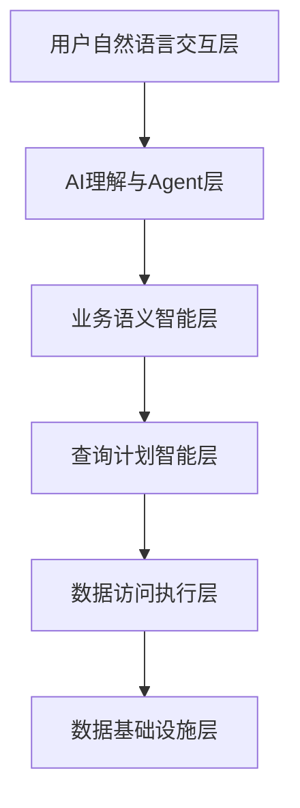


---


# 3.1 六层架构模型


SuperBuilder AI Native BI采用六层架构：


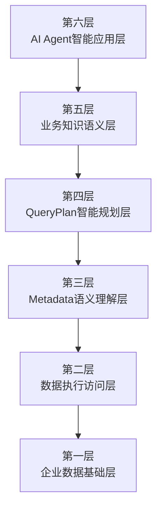


---

# 4. 六层系统架构详细设计


# 第一层：企业数据基础层


## Data Foundation Layer


负责：

连接企业数据。


支持：


- SQL Server
- MySQL
- PostgreSQL
- 未来数据湖


架构：


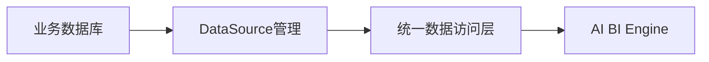


---


# 第二层：数据访问执行层


## Data Execution Layer


职责：

负责：

- SQL生成
- SQL执行
- 数据返回


核心流程：


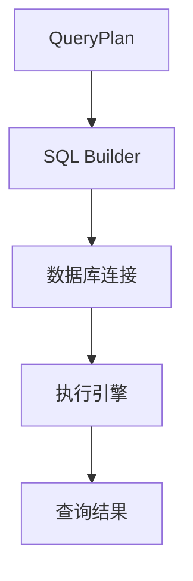


---


# 第三层：Metadata语义理解层


## Metadata Semantic Intelligence Layer


目标：

让AI理解：

数据库结构代表什么业务含义。


包括：

- 表
- 字段
- 类型
- 描述
- 业务语义
- 同义词


架构：


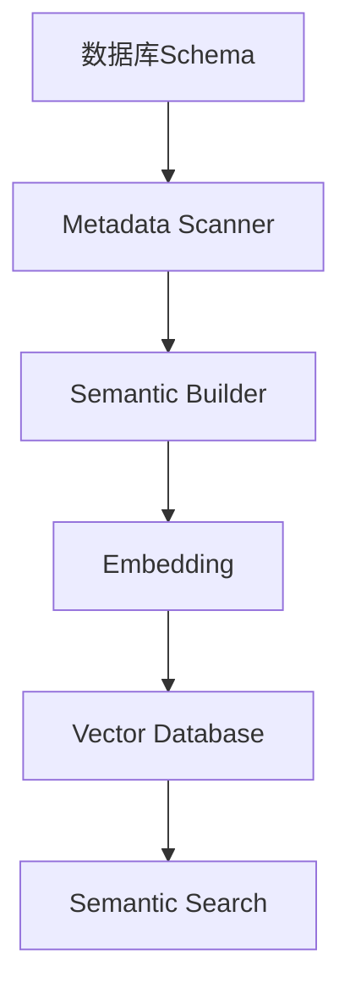


---

# 第四层：QueryPlan智能规划层


## QueryPlan Intelligence Layer


这是SuperBuilder AI Native BI核心创新。


核心思想：


> AI不直接生成SQL，而生成业务查询计划。


流程：

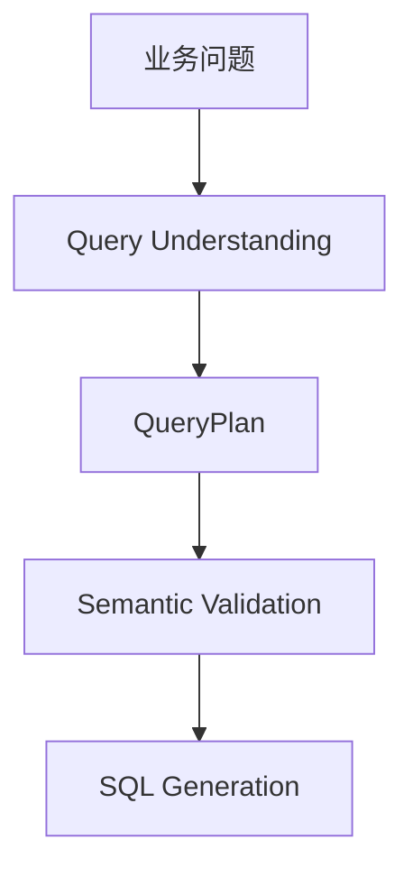


# 5. QueryPlan Intelligence 智能查询规划层


## 5.1 设计理念


传统 Text-To-SQL 架构：

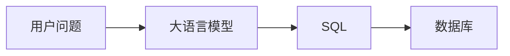


存在问题：

- AI直接操作数据库语言
- 缺少业务理解过程
- 无法验证业务合理性
- 错误难以修复
- 无法解释生成原因


SuperBuilder AI Native BI采用：

> QueryPlan First Architecture（查询计划优先架构）


即：


核心思想：

SQL只是执行语言。

QueryPlan才是真正的业务分析模型。


---


# 5.2 QueryPlan整体架构


QueryPlan Intelligence由以下模块组成：


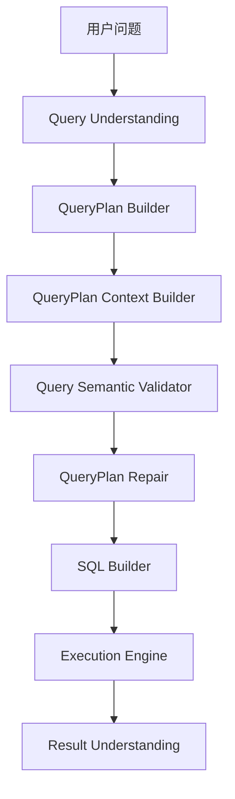


---


# 5.3 QueryPlan核心模型设计


QueryPlan描述一次完整的数据分析任务。


模型结构：


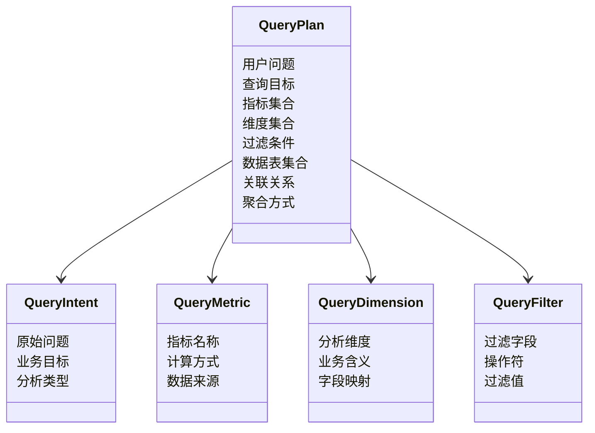


---

# 5.4 QueryPlan生成过程


生成过程：


```mermaid
sequenceDiagram


participant User as 用户

participant AI as AI理解模块

participant Metadata as 元数据语义层

participant Plan as QueryPlan


User->>AI:
提出业务问题


AI->>Metadata:
搜索相关业务语义


Metadata-->>AI:
返回业务对象


AI->>Plan:
生成查询计划


Plan-->>User:
返回分析方案


```


---


# 5.5 QueryPlan可靠性体系


企业级BI不能只生成查询。


必须保证：

- 正确
- 可解释
- 可修复
- 可评估


因此建立：


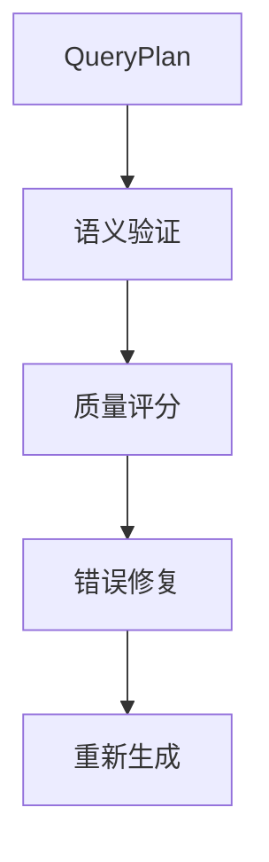


---

# 5.6 QueryPlan Semantic Validation


## 查询计划语义验证


验证内容：


## 1. 指标验证


检查：


- 指标是否存在
- 指标定义是否正确
- 聚合方式是否合理


例如：


错误：

```
客户数量 = SUM(CustomerId)

```


正确：

```
客户数量 = COUNT(CustomerId)

```


---


## 2. 维度验证


检查：


- 分析维度是否合法
- 是否属于业务范围


例如：


问题：

```
销售趋势

```


合理维度：

```
日期

月份

季度

区域

```


---


## 3. 数据关系验证


检查：

```
订单

↓

客户

↓

产品

```


是否存在正确关系。


---


# 5.7 QueryPlan Explainability


未来增强能力：


AI不仅回答结果：

还解释：

为什么这样分析。


例如：

用户：

```
为什么选择订单表？

```


AI：


```
因为：

1. 用户问题涉及销售金额

2. 销售金额字段存在于订单表

3. 订单表包含时间字段

4. 订单表包含区域字段


因此选择订单表。

```


---


# 6. Metadata Semantic Intelligence


## 企业元数据语义智能层


## 6.1 设计目标


传统数据库：

只能看到：

```
Table

Column

DataType

```


AI需要理解：

```
客户

销售

收入

利润

```


因此建立：

Metadata Semantic Intelligence。


---


# 6.2 Metadata Semantic Architecture


整体流程：


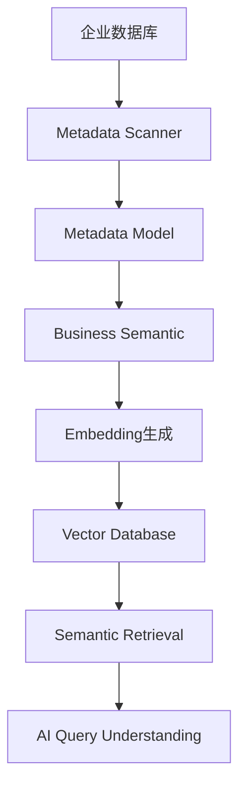


---


# 6.3 Metadata模型体系


核心对象：


## MetadataTable


描述：

数据库表业务含义。


例如：


```
表：

orders


业务：

销售订单

```


---


## MetadataColumn


描述：

字段业务含义。


例如：


数据库：


```
amount

```


AI理解：


```
销售金额

订单金额

交易金额

```


---


## MetadataSemantic


保存：


- Business Meaning
- Keyword
- Synonym
- Example Question


例如：


```
销售额

关键词：

收入

营业额

交易金额


示例问题：

今年销售额是多少？

```


---


# 6.4 Semantic Search架构


用户问题：

```
查询今年销售额

```


搜索流程：


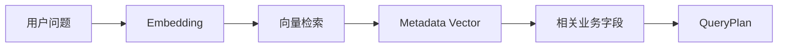


---


# 7. Vector Semantic Intelligence


## 7.1 为什么需要向量数据库


传统搜索：

关键词匹配。


例如：


```
销售额

```


无法匹配：

```
营业收入

```


向量搜索：

理解语义。


---


# 7.2 Vector Architecture


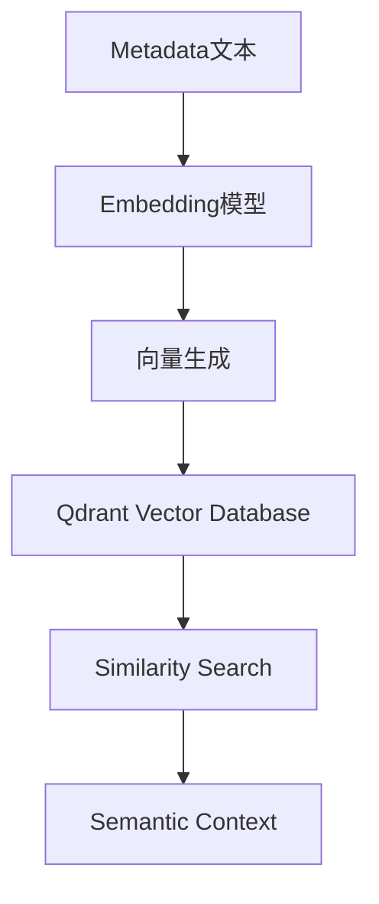


---


# 7.3 Qdrant职责


Qdrant负责：


- Metadata向量存储
- 相似度查询
- 语义召回
- 上下文提供


---


# 8. SQL智能生成层


## 8.1 设计原则


SQL不是AI直接创造。


SQL来自：

```
QueryPlan

↓

SQL Builder

↓

Dialect Layer

↓

Database

```


---


# 8.2 SQL Generation Architecture


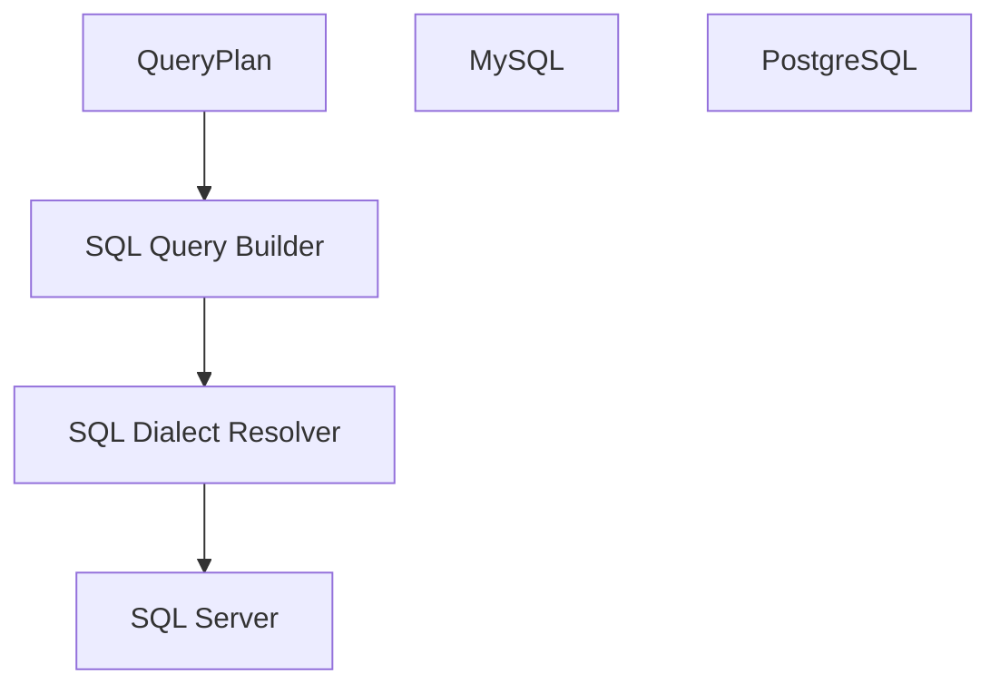


---


# 8.3 数据库方言层


支持：


|数据库|状态|
|-|-|
|SQL Server|支持|
|MySQL|支持|
|PostgreSQL|支持|


设计：


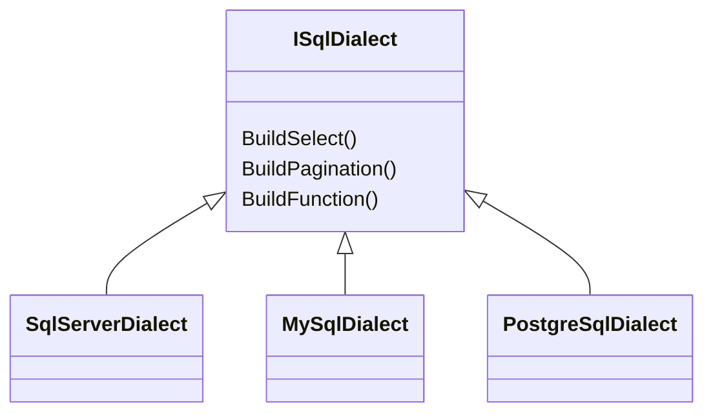


---


# 8.4 SQL执行链


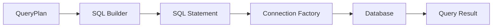


---


# Part 2总结


截至目前，SuperBuilder AI Native BI已经形成：


```mermaid
flowchart TD


A[自然语言]


-->

B[业务理解]


-->

C[Metadata语义搜索]


-->

D[QueryPlan规划]


-->

E[语义验证]


-->

F[SQL生成]


-->

G[数据执行]


```


核心创新：

> 使用 QueryPlan 作为 AI 与企业数据之间的业务智能中间层。


# 9. Knowledge Graph 企业知识图谱演进


## 9.1 建设背景


当前阶段：

SuperBuilder AI Native BI 已经能够理解：

- 数据结构
- 字段含义
- 查询逻辑


但是企业智能分析最终需要理解：

- 企业业务关系
- 企业运行规则
- 企业管理逻辑


因此需要从：

```
数据理解

```

升级为：

```
企业知识理解

```


---

# 9.2 企业知识图谱目标


Knowledge Graph 的目标：

建立企业数字知识模型。


包括：

- 企业实体
- 业务关系
- 指标体系
- 业务规则
- 数据血缘
- 分析经验


最终形成：

> 企业业务知识大脑。


---

# 9.3 Knowledge Graph总体架构


```mermaid
flowchart TD


A[企业数据]


-->

B[Metadata语义层]


-->

C[业务实体模型]


-->

D[指标知识模型]


-->

E[业务规则模型]


-->

F[企业知识图谱]


-->

G[AI推理能力]


```


---

# 9.4 企业知识模型


## 业务实体


例如：

```
客户

产品

订单

合同

员工

供应商

```


---


## 业务关系


例如：


```
客户

|

拥有

|

订单


订单

|

包含

|

产品

```


结构：

```mermaid
graph LR


A[客户]

--拥有-->

B[订单]


B

--包含-->

C[产品]


B

--产生-->

D[收入]


```


---


## 指标知识


例如：

利润：

```
利润

=

收入

-

成本

```


知识图谱保存：

```mermaid
flowchart TD


A[利润指标]


-->

B[收入指标]


A

-->

C[成本指标]


B

-->

D[销售数据]


C

-->

E[成本数据]


```


---

# 9.5 Knowledge Graph价值


## 1. 智能分析路径推荐


用户：

```
为什么利润下降？

```


AI自动规划：


```mermaid
flowchart TD


A[利润下降]


-->

B[收入变化分析]


A

-->

C[成本变化分析]


B

-->

D[销售分析]


C

-->

E[成本结构分析]


D

-->

F[客户分析]


E

-->

G[供应链分析]


```


---


## 2. 业务影响分析


例如：

修改产品价格：

AI可以分析：


```
影响客户

↓

影响订单

↓

影响收入

↓

影响利润


```


---


# 10. AI Agent体系架构


## 10.1 Agent演进目标


SuperBuilder AI Native BI最终目标：

从：

```
AI查询助手

```


发展为：

```
AI业务分析Agent

```


---


# 10.2 AI Agent总体架构


```mermaid
flowchart TD


A[SuperBuilder AI BI Agent]


A -->

B[Query Agent]


A -->

C[Analysis Agent]


A -->

D[Report Agent]


A -->

E[Recommendation Agent]


A -->

F[Decision Agent]


```


---

# 10.3 Query Agent


职责：


负责：

- 理解用户问题
- 创建QueryPlan
- 执行数据查询


流程：


```mermaid
flowchart LR


A[用户问题]


-->

B[Query Agent]


-->

C[QueryPlan]


-->

D[SQL执行]


-->

E[结果]


```


---

# 10.4 Analysis Agent


职责：

自动分析：

- 趋势
- 异常
- 原因


架构：


```mermaid
flowchart TD


A[查询结果]


-->

B[趋势分析]


-->

C[异常检测]


-->

D[原因推理]


-->

E[业务洞察]


```


---

# 10.5 Report Agent


目标：

自动生成企业分析报告。


输出：

- 管理驾驶舱
- 周报
- 月报
- 经营分析报告


流程：


```mermaid
flowchart LR


A[分析结果]


-->

B[Report Agent]


-->

C[业务报告]


-->

D[管理层阅读]


```


---

# 10.6 Recommendation Agent


目标：

回答：

不仅告诉企业：

```
发生了什么

```


还告诉：

```
应该怎么办

```


例如：

发现：

```
华东销售下降

```


AI建议：


```
原因：

核心客户减少


建议：

提升重点客户维护频率


```


---


# 10.7 Decision Agent


最终阶段：

AI参与企业决策。


流程：


```mermaid
flowchart TD


A[企业问题]


-->

B[数据分析]


-->

C[知识推理]


-->

D[方案生成]


-->

E[决策建议]


-->

F[效果跟踪]


```


---


# 11. AI Native BI未来演进路线


整体演进：


```mermaid
flowchart LR


A[BI查询工具]


-->

B[AI查询助手]


-->

C[AI BI分析师]


-->

D[AI业务Agent]


-->

E[企业智能决策平台]


```


---

# 11.1 第一阶段

## AI Query Assistant


能力：

- 自然语言查询
- 自动生成SQL
- 数据回答


当前：

✅ 已实现


---


# 11.2 第二阶段

## AI BI Analyst


能力：

- 自动分析趋势
- 发现异常
- 生成报告


规划：

Phase 5


---


# 11.3 第三阶段

## AI Business Agent


能力：

- 主动发现问题
- 自动分析原因
- 提供业务建议


规划：

Phase 5


---


# 11.4 第四阶段

## Enterprise Intelligence Platform


能力：

- 企业知识推理
- 自动决策辅助
- 应用自动生成


规划：

Phase 6


---


# 12. 企业价值分析


## 12.1 降低数据分析门槛


传统方式：


```
业务人员

↓

BI人员

↓

数据工程师

↓

SQL

↓

结果


```


AI Native BI：


```mermaid
flowchart LR


A[业务人员]


-->

B[自然语言]


-->

C[AI分析]


-->

D[结果]


```


---


## 12.2 提升分析效率


传统：

```
数小时

甚至数天

```


AI：

```
分钟级分析

```


---


## 12.3 提升企业数据利用率


帮助企业：

从：

```
数据存储

```


变为：

```
数据资产

```


---


## 12.4 沉淀企业知识


通过：

- Metadata
- Semantic Layer
- Knowledge Graph


形成企业长期智能资产。


---


# 13. 技术竞争优势


## 13.1 QueryPlan First架构优势


区别传统Text-To-SQL：


|传统方式|SuperBuilder|
|-|-|
|问题直接生成SQL|问题先生成QueryPlan|
|缺少业务验证|具备语义验证|
|错误难修复|支持自动修复|
|不可解释|支持分析解释|


---


## 13.2 企业语义理解能力


传统BI：

理解：

```
字段

表

数据

```


SuperBuilder：

理解：

```
业务对象

指标

规则

关系

知识

```


---


## 13.3 AI Agent演进能力


平台不是单点AI功能。


而是：


```mermaid
flowchart TD


A[数据]


+

B[业务知识]


+

C[AI模型]


+

D[Agent能力]


-->

E[企业智能平台]


```


---


## 13.4 AI Native Low-Code融合优势


未来：

BI能力与应用生成融合。


形成：


```mermaid
flowchart TD


A[业务需求]


-->

B[AI理解]


-->

C[生成应用]


-->

D[生成数据模型]


-->

E[生成BI能力]


-->

F[持续智能优化]


```


---


# 14. 总结


SuperBuilder AI Native BI 的核心理念：


> 让企业数据、企业知识和人工智能真正融合。


技术路线：


```mermaid
flowchart TD


A[企业数据]


-->

B[Metadata Semantic Intelligence]


-->

C[QueryPlan Intelligence]


-->

D[Business Semantic Layer]


-->

E[Knowledge Graph]


-->

F[AI Agent]


-->

G[AI Native Enterprise Platform]


```


最终目标：


不是构建一个新的BI工具。


而是构建：

> 企业级 AI Native Business Intelligence Agent Platform。


未来企业员工只需要表达：

```
我想知道业务发生了什么

我想知道为什么

我想知道应该怎么办

我想创建一个业务系统


```


SuperBuilder AI Native BI 将自动完成：


```
理解

分析

推理

生成

优化


```


---

# 文档结束


文档名称：

SuperBuilder AI Native BI架构白皮书


版本：

v1.0


状态：

正式版

