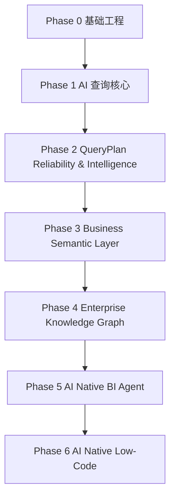
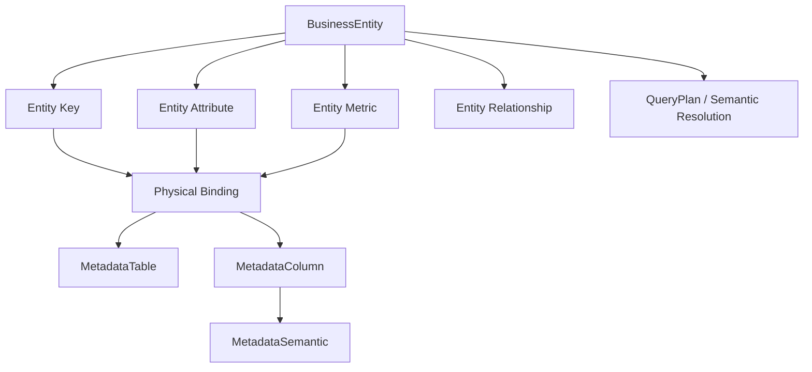

# SuperBuilder AI Native BI
# Phase开发计划（正式版）

版本：v3.0

文档状态：**Phase 3.1 开发基线**

当前开发阶段：

> **Phase 3.1 — Business Entity Model / Contract Design**

当前冻结基线：

> **Phase 2.7 — CLOSED / FROZEN**

当前源码基线：

> GitHub `master`

项目名称：

> SuperBuilder AI Native BI

更新日期：2026-08-27

---

# 目录

- [1. 项目定位](#1-项目定位)
- [2. 总体技术路线](#2-总体技术路线)
- [3. Phase开发总览](#3-phase开发总览)
- [4. 阶段事实与冻结原则](#4-阶段事实与冻结原则)
- [5. Phase 0 基础工程架构](#5-phase-0-基础工程架构)
- [6. Phase 1 AI智能查询核心能力](#6-phase-1-ai智能查询核心能力)
- [7. Phase 2 QueryPlan可靠性与智能决策](#7-phase-2-queryplan可靠性与智能决策)
- [8. Phase 2.7 Advanced SQL Planning](#8-phase-27-advanced-sql-planning)
- [9. Phase 2 总体验收](#9-phase-2-总体验收)
- [10. Phase 3 企业业务语义层](#10-phase-3-企业业务语义层)
- [11. Phase 3.1 Business Entity Model](#11-phase-31-business-entity-model)
- [12. Phase 3.1 Contract](#12-phase-31-contract)
- [13. Phase 3.1 源码映射](#13-phase-31-源码映射)
- [14. Phase 3.1 Golden 与 Runtime 验证](#14-phase-31-golden-与-runtime-验证)
- [15. Phase 3.1 验收标准](#15-phase-31-验收标准)
- [16. Phase 4 企业知识图谱](#16-phase-4-企业知识图谱)
- [17. Phase 5 AI Native BI Agent](#17-phase-5-ai-native-bi-agent)
- [18. Phase 6 AI Native Low-Code融合](#18-phase-6-ai-native-low-code融合)
- [19. 总体开发优先级](#19-总体开发优先级)
- [20. 阶段冻结与变更控制](#20-阶段冻结与变更控制)
- [21. 当前阶段结论](#21-当前阶段结论)

---

# 1. 项目定位

SuperBuilder AI Native BI 面向企业数据智能分析，目标不是单纯生成 SQL，而是建立可靠的业务语义、查询规划、验证、决策和执行链路。

总体链路：

```text
用户自然语言问题
        ↓
AI / Query Understanding
        ↓
Business Semantic
        ↓
Metadata Semantic
        ↓
QueryPlan
        ↓
Validation / Repair
        ↓
Confidence / Decision Gate
        ↓
SQL Builder
        ↓
Database Execution
        ↓
Result Understanding
        ↓
Business Answer
```

Phase 3 的核心升级是：

```text
“理解字段”
        ↓
“理解业务实体”
        ↓
“理解实体之间的业务关系”
```

---

# 2. 总体技术路线



| 阶段 | 目标 | 状态 |
|---|---|---|
| Phase 0 | 基础工程架构 | ✅ 已完成 |
| Phase 1 | AI智能查询核心能力 | ✅ 已完成 |
| Phase 2 | QueryPlan可靠性与智能决策 | ✅ CLOSED / FROZEN |
| Phase 3 | 企业业务语义层 | 🚧 当前阶段 |
| Phase 4 | 企业知识图谱 | 📌 规划 |
| Phase 5 | AI Native BI Agent | 📌 规划 |
| Phase 6 | AI Native Low-Code融合 | 📌 规划 |

---

# 3. Phase开发总览

## Phase 2 Frozen Foundation

```text
Phase 2
│
├── 2.1 QueryPlan Foundation
├── 2.2 QueryPlan Semantic Validation
├── 2.2.5 QueryPlan Auto Repair
├── 2.3 QueryPlan Repair Reliability
├── 2.4 QueryPlan Confidence & Decision Gate
├── 2.5 QueryPlan Explainability
├── 2.6 Query Evaluation Framework
└── 2.7 Advanced SQL Planning
        ↓
     CLOSED / FROZEN
```

## Phase 3 当前路线

```text
Phase 3
│
└── 3.1 Business Entity Model
    │
    ├── 3.1.1 Current Source Audit
    ├── 3.1.2 Business Entity Contract
    ├── 3.1.3 Entity Key Contract
    ├── 3.1.4 Entity Attribute Contract
    ├── 3.1.5 Entity Metric Contract
    ├── 3.1.6 Entity Relationship Contract
    ├── 3.1.7 Physical Binding Contract
    ├── 3.1.8 QueryPlan Mapping Contract
    ├── 3.1.9 Golden Contract
    ├── 3.1.10 Runtime Verification Design
    └── 3.1.11 Source Implementation Mapping
```

**3.1.1–3.1.11 完成 Contract / Mapping / Verification Design 后，才进入生产代码实现。**

---

# 4. 阶段事实与冻结原则

## 4.1 源码事实原则

所有完成度判断以 GitHub `master` 最新源码为第一事实来源。设计文档、历史讨论、README 和规划内容不能单独证明功能完成。

## 4.2 Frozen 原则

Phase 2.7 已经形成稳定执行基础。Phase 3 不得为了引入 Business Entity 而重新定义 Phase 2.7 已冻结的 QueryPlan、Evaluator、Golden、Decision Gate 或 SQL Builder Contract。

## 4.3 Phase 推进原则

```text
源码审计
 ↓
Contract Design
 ↓
源码映射
 ↓
Golden Design
 ↓
Runtime Design
 ↓
实现
 ↓
编译
 ↓
Runtime 验证
 ↓
验收
 ↓
冻结
```

禁止：

```text
设计完成 → 直接宣布完成
```

---

# 5. Phase 0 基础工程架构

状态：**✅ 已完成**

目标：建立 Controller / Application / Domain / Infrastructure / Database 分层、DI、数据库访问和基础配置能力。

---

# 6. Phase 1 AI智能查询核心能力

状态：**✅ 已完成**

核心能力：

```text
Natural Language
 ↓
Query Understanding
 ↓
Metadata Semantic Search
 ↓
QueryPlan
 ↓
SQL Builder
 ↓
Database
```

核心对象包括 QueryIntent、QueryMetric、QueryFilter、QueryDimension、QueryPlan。

---

# 7. Phase 2 QueryPlan可靠性与智能决策

状态：**✅ CLOSED / FROZEN**

Phase 2 的目标是将“能够生成查询”升级为“能够验证、修复、解释、评估并决定是否允许执行”。

核心能力：

```text
QueryPlan
 ↓
Context / Semantic Validation
 ↓
Repair
 ↓
Repair Trace
 ↓
Confidence
 ↓
Decision Gate
 ↓
Explainability
 ↓
Evaluation / Golden
 ↓
Advanced SQL Planning
```

Phase 2 的既有 Contract 在 Phase 3 中视为 Frozen Foundation。

---

# 8. Phase 2.7 Advanced SQL Planning

状态：**✅ CLOSED / FROZEN**

Phase 2.7 的 Frozen 边界包括 QueryPlan、Semantic Resolution、Dimension Resolution、Join Resolution、Evaluator、Golden Dataset、Decision Gate 和 SQL Builder 的既有执行契约。

Phase 3 只能在这些能力之上增加 Business Semantic Layer，不得通过隐式修改破坏已有执行链路。

---

# 9. Phase 2 总体验收

Phase 2 的进入 Phase 3 条件：

- D14–D20 Frozen
- D21 Exit Review Frozen
- Golden / Runtime 验证通过
- Build / Startup 验证通过
- Phase 2.7 CLOSED
- 不再有未关闭的 Phase 2 Gate

因此 Phase 3 从一个明确的 Frozen 基线开始。

---

# 10. Phase 3 企业业务语义层

## 10.1 阶段目标

Phase 3 不再只解决：

> “用户说的词对应哪个数据库字段？”

而开始解决：

> “用户说的业务对象是什么？它有哪些属性、指标和业务关系？这些业务语义如何稳定映射到已有 Metadata 与 QueryPlan？”

## 10.2 核心演进

```text
Metadata Semantic
      ↓
Business Entity Semantic
      ↓
Entity Resolution
      ↓
QueryPlan Mapping
      ↓
Existing Phase 2.7 Execution Foundation
```

## 10.3 非目标

Phase 3.1 暂不做：

- 重构 QueryPlan
- 重构 QueryIntent
- 修改 Evaluator Contract
- 修改 Phase 2.7 Golden Expected Outcome
- 修改 Decision Gate
- 直接从 Entity 生成 SQL
- 知识图谱
- 自动实体学习
- 复杂 Ontology

---

# 11. Phase 3.1 Business Entity Model

状态：**🚧 CURRENT — Contract Design**

## 11.1 目标

建立第一版稳定、可执行、可验证的 Business Entity Contract。

核心概念：

```text
BusinessEntity
├── BusinessEntityKey
├── BusinessEntityAttribute
├── BusinessEntityMetric
└── BusinessEntityRelationship
```

并统一通过 Physical Binding 映射已有 Metadata。

## 11.2 总体模型



---

# 12. Phase 3.1 Contract

## 12.1 BusinessEntity

语义职责：描述稳定的业务对象，不等同于数据库表。

建议 Contract：

```text
BusinessEntity
├── Id
├── BusinessKey
├── Name
├── DisplayName
├── Description
├── BusinessDomain
├── SemanticText
└── Status
```

## 12.2 BusinessEntityKey

描述实体身份，可绑定一个或多个物理 Key。

```text
BusinessEntityKey
├── BusinessEntityId
├── Name
├── IsPrimary
└── PhysicalBinding
```

## 12.3 BusinessEntityAttribute

描述实体的业务属性，例如供应商名称、客户类型、产品类别。

```text
BusinessEntityAttribute
├── BusinessEntityId
├── Name
├── DisplayName
├── Description
└── PhysicalBinding
```

## 12.4 BusinessEntityMetric

描述与实体相关的业务度量，但不直接保存 SQL。

```text
BusinessEntityMetric
├── BusinessEntityId
├── Name
├── DisplayName
├── Description
├── Aggregation
└── PhysicalBinding / Metric Resolution
```

## 12.5 BusinessEntityRelationship

描述实体之间的业务关系，而不是简单复制数据库 FK。

```text
BusinessEntityRelationship
├── SourceEntityId
├── TargetEntityId
├── RelationshipType
├── Cardinality
└── Physical Join Binding
```

## 12.6 PhysicalBinding

Physical Binding 是 Business Semantic 与现有 Metadata 之间的唯一桥梁。

```text
PhysicalBinding
├── DataSourceId
├── MetadataTableId
├── MetadataColumnId
└── BusinessKey
```

原则：

> Business Entity 不重新定义 Physical Identity；复用现有 Metadata Identity。

---

# 13. Phase 3.1 源码映射

3.1.1 必须逐文件审计以下现有能力：

| Contract | 当前源码基础 | 目标 |
|---|---|---|
| BusinessEntity | 当前无直接等价物 | 新增 Contract |
| EntityKey | MetadataColumn / Primary Key 能力 | 建立业务身份层 |
| EntityAttribute | MetadataColumn + MetadataSemantic | 建立业务属性层 |
| EntityMetric | QueryMetric / Metric Resolution | 建立业务指标层 |
| EntityRelationship | QueryJoin / Join Resolution | 建立业务关系层 |
| PhysicalBinding | MetadataColumn / BusinessKey | **优先复用** |
| Entity Resolution | 当前 QueryPlan Semantic Resolution | 新增 Entity Resolution 边界 |
| QueryPlan Mapping | QueryPlanSemanticResolution | 增加 Adapter / Mapping，不破坏 Frozen Contract |

## 13.1 必审源码范围

```text
Models/Metadata/*
Models/BI/QueryPlan.cs
Models/BI/QueryMetric.cs
Models/BI/QueryDimension.cs
Models/BI/QueryJoin.cs
Models/BI/QueryPlanSemanticResolution.cs
Services/BI/QueryPlanBuilder*
Services/BI/QueryPlanSemanticValidator.cs
Services/BI/QueryJoinInferenceService.cs
Services/BI/Evaluation/QueryPlanEvaluator.cs
Services/BI/Evaluation/*Golden*
Data/SuperBIContext.cs
Program.cs
```

源码审计输出必须包含：

```text
文件
 ↓
类型 / 接口
 ↓
当前职责
 ↓
Phase 3.1 Contract 对应关系
 ↓
复用 / 扩展 / 新增 / 禁止修改
```

---

# 14. Phase 3.1 Golden 与 Runtime 验证

## 14.1 Golden 第一层：Entity Resolution

先验证业务实体识别，不直接验证 SQL。

示例：

```text
“供应商有哪些？”
    ↓
Entity = Supplier

“供应商采购金额”
    ↓
Entity = Supplier
Metric = PurchaseAmount

“按供应商统计采购金额”
    ↓
Entity = Supplier
Dimension = Supplier.Name
Metric = PurchaseAmount
```

## 14.2 Golden 第二层：Entity → QueryPlan

```text
Business Entity
      ↓
Entity Attribute / Metric / Relationship
      ↓
QueryPlan Mapping
      ↓
QueryPlanSemanticResolution
```

## 14.3 Golden 第三层：复用 Phase 2.7

```text
QueryPlan
 ↓
Existing Evaluator
 ↓
Existing Golden / Decision Foundation
```

原则：

> Phase 3 Golden 是新增覆盖，不修改 Phase 2.7 Frozen Golden 的既有语义。

## 14.4 Runtime 验证顺序

```text
Contract Unit Verification
        ↓
Entity Resolution Verification
        ↓
Entity → Metadata Binding
        ↓
Entity → QueryPlan Mapping
        ↓
Existing Phase 2.7 Validation
        ↓
Existing Evaluator
        ↓
Existing SQL / Runtime Path
```

---

# 15. Phase 3.1 验收标准

Phase 3.1 只有同时满足以下条件才能关闭：

### Contract

- BusinessEntity Contract 冻结
- Key / Attribute / Metric / Relationship Contract 冻结
- PhysicalBinding Contract 冻结
- QueryPlan Mapping Contract 冻结

### Source

- 完成相关源码逐文件审计
- 明确新增 / 复用 / 扩展 / 禁止修改范围
- DI、调用链和 namespace 边界明确

### Golden

- Entity Resolution Golden 建立
- Entity → QueryPlan Golden 建立
- 不破坏 Phase 2.7 Frozen Golden

### Runtime

- Entity Resolution Runtime 验证通过
- Physical Binding Runtime 验证通过
- Entity → QueryPlan Runtime 验证通过
- Existing Phase 2.7 Runtime 回归通过

### Engineering

- Build PASS
- Startup PASS
- 无明显 Contract 漂移
- 文档 / 源码 / Golden / Runtime 四方一致

最终状态：

```text
Phase 3.1
    CLOSED / FROZEN
```

---

# 16. Phase 4 企业知识图谱

状态：📌 规划

目标：在稳定 Business Entity Model 基础上建立企业实体、关系、事件与知识网络。

不得提前侵入 Phase 3.1。

---

# 17. Phase 5 AI Native BI Agent

状态：📌 规划

目标：在可靠 Query Planning 与 Business Semantic 基础上形成可执行的 BI Agent。

---

# 18. Phase 6 AI Native Low-Code融合

状态：📌 规划

目标：将 AI Query、Business Semantic、Agent 与低代码应用能力融合。

---

# 19. 总体开发优先级

```text
P0  Phase 2.7 Frozen Foundation
        ↓
P1  Phase 3.1 Contract Design
        ↓
P2  Phase 3.1 Source Audit / Mapping
        ↓
P3  Phase 3.1 Golden / Runtime Design
        ↓
P4  Phase 3.1 Implementation
        ↓
P5  Phase 3.1 Verification / Freeze
        ↓
P6  Phase 3.2+ Business Semantic Capabilities
        ↓
P7  Phase 4 Knowledge Graph
        ↓
P8  Phase 5 Agent
        ↓
P9  Phase 6 Low-Code
```

---

# 20. 阶段冻结与变更控制

## 20.1 Frozen Contract 不得隐式修改

Phase 2.7 Frozen 后，任何涉及以下对象的修改都必须显式记录：

- QueryPlan
- QueryPlanSemanticResolution
- QueryPlan Evaluator
- Golden Expected Outcome
- Decision Gate
- SQL Builder
- Existing Runtime Contract

## 20.2 Phase 3 新增能力必须有边界

```text
Business Semantic Layer
        ↓
Entity Resolution / Mapping
        ↓
Frozen QueryPlan Foundation
```

不得：

```text
Business Entity
        ↓
绕过 QueryPlan
        ↓
直接 SQL
```

## 20.3 文档同步原则

每次 Phase / STEP 状态发生变化，必须同步更新：

```text
Phase开发计划
    +
总体设计方案
    +
架构白皮书
    +
STEP / Runtime 状态文档
    +
源码 / Golden
```

阶段切换的第一动作必须是更新开发计划，随后才能开始下一阶段源码工作。

---

# 21. 当前阶段结论

当前正式状态：

```text
Phase 2.7
    CLOSED / FROZEN

        ↓

Phase 3
    CURRENT

        ↓

Phase 3.1
    Business Entity Model
    Contract Design
    CURRENT
```

当前下一动作：

> **3.1.1 Current Source Audit**

工作顺序固定为：

```text
master 源码逐文件审计
        ↓
确认现有 Metadata / QueryPlan / Resolution 能力
        ↓
确认 Business Entity Contract 与现有代码的边界
        ↓
形成源码映射表
        ↓
冻结 3.1 Contract
        ↓
设计 Golden / Runtime
        ↓
开始编码
```

**Phase 3.1 在 Contract、源码、Golden、Runtime 四方一致之前，不得宣布完成。**
