# SuperBuilder AI Native BI
# Phase开发计划（正式版）


版本：

v2.0


文档状态：

正式规划版


当前开发阶段：

> Phase 2.3 查询计划可靠性增强


当前系统完成度：

> 约 80% ~ 85%


---

# 目录


- [1. 项目定位](#1-项目定位)

- [2. 总体技术路线](#2-总体技术路线)

- [3. 当前系统完成状态](#3-当前系统完成状态)

- [4. Phase 0 基础工程架构](#4-phase-0-基础工程架构)

- [5. Phase 1 AI智能查询核心能力](#5-phase-1-ai智能查询核心能力)

- [6. Phase 2 查询计划可靠性增强](#6-phase-2-查询计划可靠性增强)

- [7. Phase 3 企业业务语义层](#7-phase-3-企业业务语义层)

- [8. Phase 4 企业知识图谱](#8-phase-4-企业知识图谱)

- [9. Phase 5 AI Native BI Agent](#9-phase-5-ai-native-bi-agent)

- [10. Phase 6 AI Native Low-Code融合](#10-phase-6-ai-native-low-code融合)

- [11. 总体开发优先级](#11-总体开发优先级)


---


# 1. 项目定位


SuperBuilder AI Native BI 是面向企业的数据智能分析平台。


区别于传统 BI：

```
人工建模

↓

人工设计指标

↓

人工制作报表

↓

用户查看结果

```


SuperBuilder AI Native BI：

通过 AI 理解业务问题，自动完成：

- 数据理解
- 查询规划
- 数据访问
- 结果分析
- 业务解释


整体目标：

> 让企业用户通过自然语言直接与企业数据进行智能分析。


---


# 2. 总体技术路线


整体演进路线：


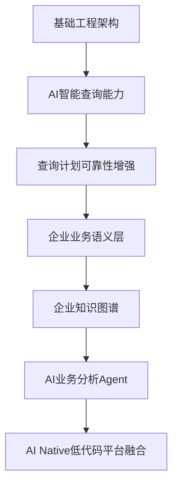


对应阶段：


|阶段|目标|状态|
|-|-|-|
|Phase 0|基础工程架构|✅ 已完成|
|Phase 1|AI智能查询核心能力|✅ 已完成|
|Phase 2|查询计划可靠性增强|🚧 当前阶段|
|Phase 3|企业业务语义层|📌 规划|
|Phase 4|企业知识图谱|📌 规划|
|Phase 5|AI Native BI Agent|📌 规划|
|Phase 6|AI Native Low-Code融合|📌 规划|


---


# 3. 当前系统完成状态


## 3.1 当前AI BI核心链路


---

## 3.2 当前模块状态


|模块|目标|状态|
|-|-|-|
|问题理解模块|理解用户业务意图|✅ 已完成|
|Metadata扫描|读取数据库结构|✅ 已完成|
|语义模型|建立业务含义|✅ 已完成|
|向量检索|业务语义搜索|✅ 已完成|
|QueryPlan生成|生成查询规划|✅ 已完成|
|查询计划验证|保证业务一致性|✅ 已完成|
|查询计划修复|自动调整错误计划|✅ 已完成|
|SQL生成|生成查询语句|🟡 基础完成|
|复杂分析SQL|支持企业复杂场景|🚧 开发中|
|业务知识模型|理解企业业务|📌 后续建设|


---


# 4. Phase 0 基础工程架构


状态：

✅ 已完成


## 4.1 阶段目标


建立稳定的企业级应用基础架构。


## 4.2 完成内容


### 应用架构


完成：

- 分层架构
- 服务接口设计
- 依赖注入
- 数据访问层


架构：


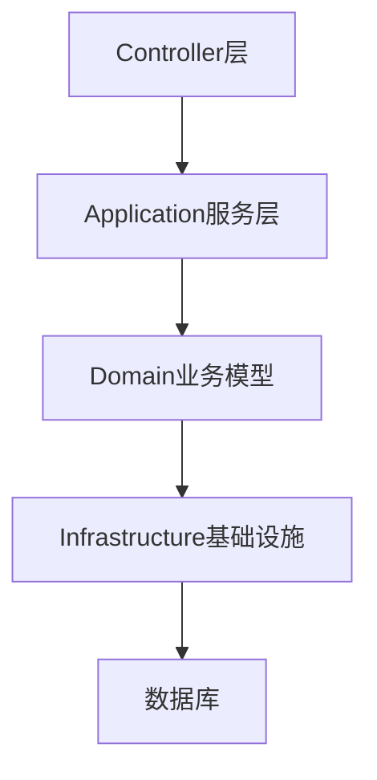


---

### 数据库支持


已支持：

- SQL Server
- MySQL
- PostgreSQL


---


# 5. Phase 1 AI智能查询核心能力


状态：

✅ 已完成


## 阶段目标


实现：

> 用户输入业务问题，AI自动完成查询。


流程：


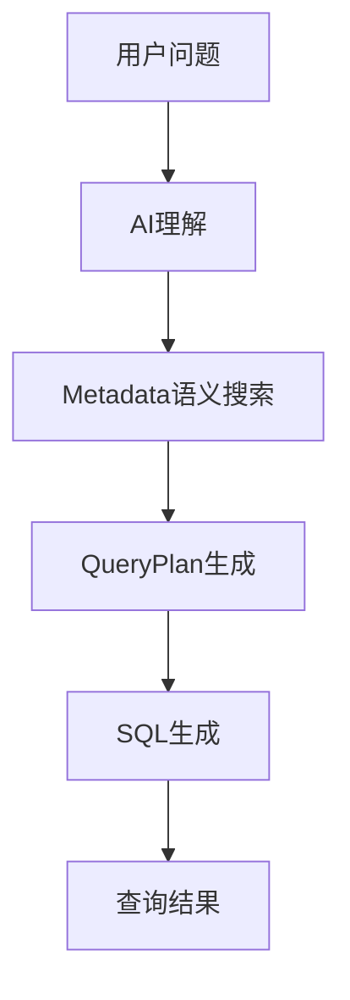


---


# Phase 1.1 问题理解能力


状态：

✅ 已完成


## 目标


识别：

- 用户意图
- 查询目标
- 指标
- 条件
- 分析维度


核心对象：


```
QueryIntent

QueryMetric

QueryFilter

QueryDimension

```


---


# Phase 1.2 Metadata语义能力


状态：

✅ 已完成


## 目标


让AI理解：

数据库字段代表什么业务含义。


流程：


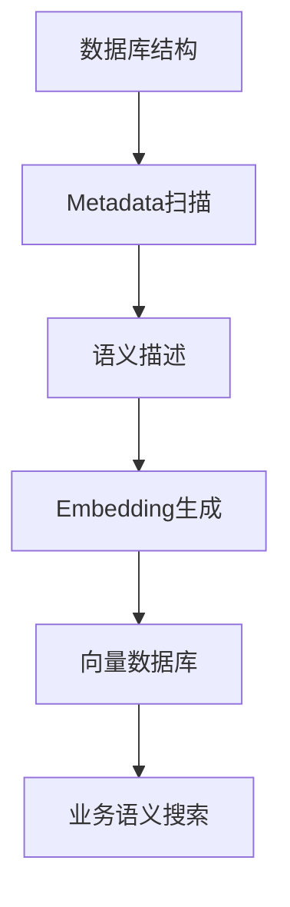


---


# Phase 1.3 查询计划能力


状态：

✅ 已完成


## 目标


建立SQL之前的业务规划层。


结构：


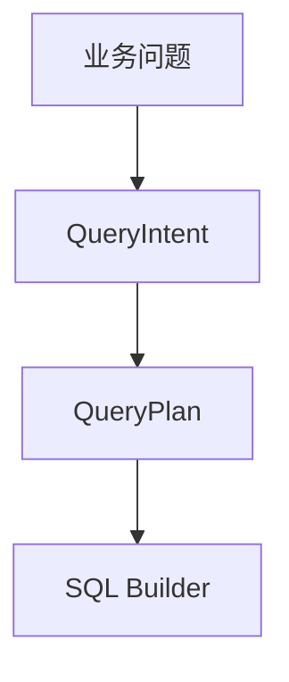


QueryPlan包含：


|对象|作用|
|-|-|
|指标|需要计算的数据|
|维度|分析角度|
|过滤条件|业务限制|
|数据表|数据来源|
|关联关系|数据连接|


---

# Phase 1.4 SQL执行能力


状态：

✅ 基础完成


完成：

- SQL生成
- 数据库连接
- 查询执行
- 返回结果


执行链：


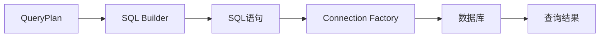

# 6. Phase 2 查询计划可靠性增强


状态：

🚧 当前开发阶段


目标：

将当前 AI 查询能力从：

```
能够生成查询
```

提升为：

```
能够生成可信查询
能够解释查询
能够验证查询
能够自动修复查询
```


---

# 6.1 阶段背景


当前 Phase 1 已经完成：

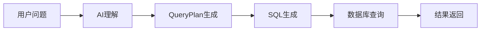

但是企业级应用仍存在问题：


|问题|说明|
|-|-|
|业务理解不足|AI可能选择错误的数据对象|
|指标定义不明确|同一个指标可能存在多个含义|
|字段匹配风险|数据库字段不一定等于业务概念|
|查询逻辑不可解释|用户不知道AI为什么这样查询|
|错误无法恢复|SQL失败后需要人工调整|


因此进入 Phase 2。


---

# 6.2 Phase 2 总体架构


Phase 2 引入：

- 查询计划上下文
- 语义验证
- 自动修复
- 查询解释


整体流程：

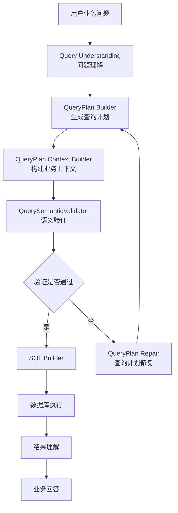


---

# 6.3 Phase 2.1 查询计划基础能力


状态：

✅ 已完成


## 阶段目标


建立 AI 与 SQL 之间的业务规划层。


核心思想：

> 不让 AI 直接生成 SQL，而是先生成结构化查询计划。


---

# 6.3.1 QueryPlan模型设计


QueryPlan负责描述一次完整业务分析任务。


结构：


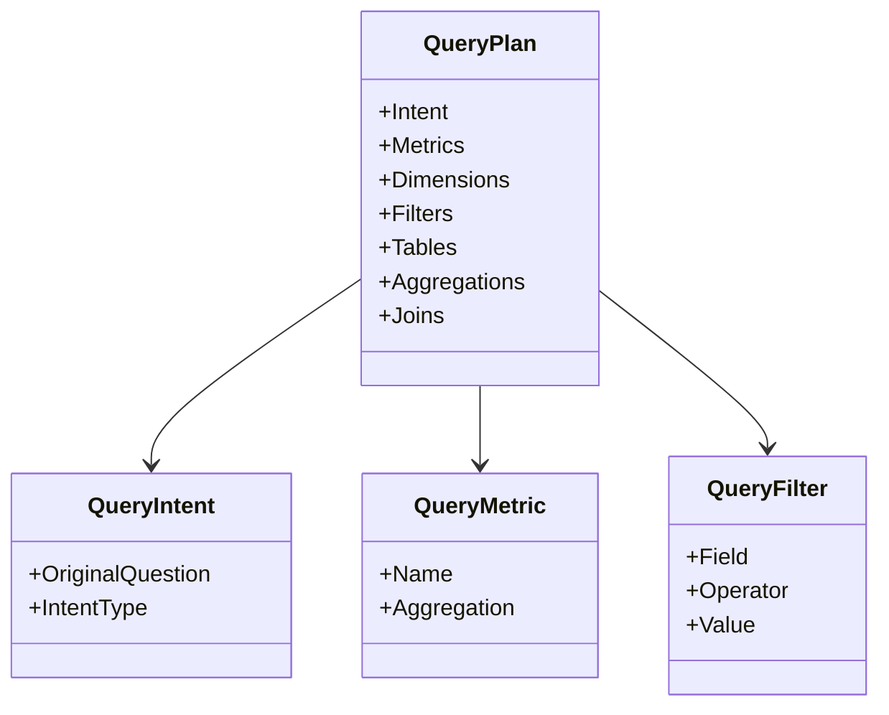


---

# 6.3.2 查询计划生成流程


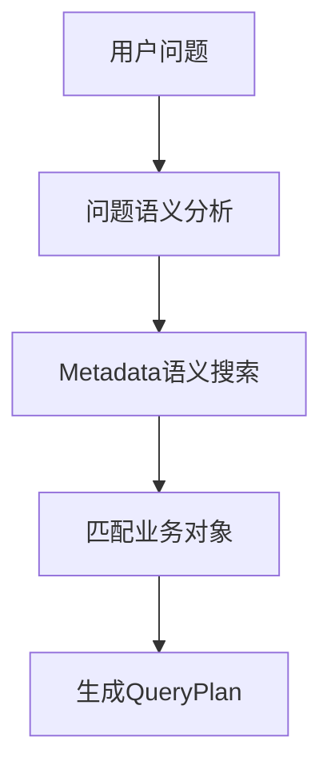


---

# Phase 2.1 完成内容


|功能|状态|
|-|-|
|QueryPlan模型|✅ 已完成|
|QueryIntent|✅ 已完成|
|QueryMetric|✅ 已完成|
|QueryFilter|✅ 已完成|
|Metadata关联|✅ 已完成|
|QueryPlan Builder|✅ 已完成|


---

# Phase 2.1 验收标准


满足：

1. 用户问题可以转换为结构化查询计划

2. 查询计划包含：

- 查询目标
- 数据来源
- 指标
- 条件
- 分析维度


3. 后续模块可以直接消费 QueryPlan。


---


# 6.4 Phase 2.2 查询计划语义一致性验证


状态：

✅ 已完成


## 阶段目标


验证：

> AI生成的查询计划是否符合企业业务语义。


---

# 6.4.1 QueryPlan Context Builder


作用：

将：

```
QueryPlan
```

转换为：

```
业务验证上下文
```


流程：


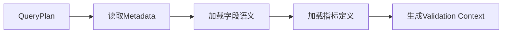


---

# 6.4.2 QuerySemanticValidator


负责验证：


## 指标验证


检查：

- 指标是否存在
- 聚合方式是否正确
- 是否符合业务定义


例如：


错误：

```
客户数量 SUM(CustomerId)

```


正确：

```
客户数量 COUNT(CustomerId)

```


---


## 维度验证


检查：

- 分组字段是否合法
- 是否属于分析范围


例如：

销售趋势：

合法：

```
订单日期

月份

季度

```


不合理：

```
身份证号码

```


---

## 条件验证


检查：

- 字段类型
- 操作符
- 参数类型


例如：


正确：

```
订单日期 >= 2026-01-01

```


错误：

```
订单金额 LIKE "ABC"

```


---


# Phase 2.2 架构


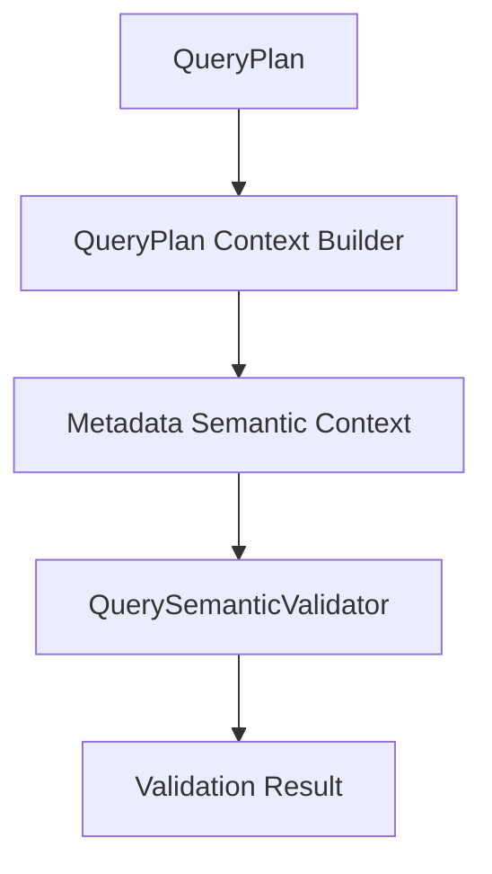


---

# Phase 2.2 完成内容


|功能|状态|
|-|-|
|上下文构建|✅ 已完成|
|Metadata语义读取|✅ 已完成|
|指标验证|✅ 已完成|
|字段验证|✅ 已完成|
|条件验证|✅ 已完成|


---

# 6.5 Phase 2.2.5 查询计划自动修复闭环


状态：

✅ 已完成


## 阶段目标


当查询计划不正确时：

AI自动调整，而不是直接失败。


---


## 修复流程


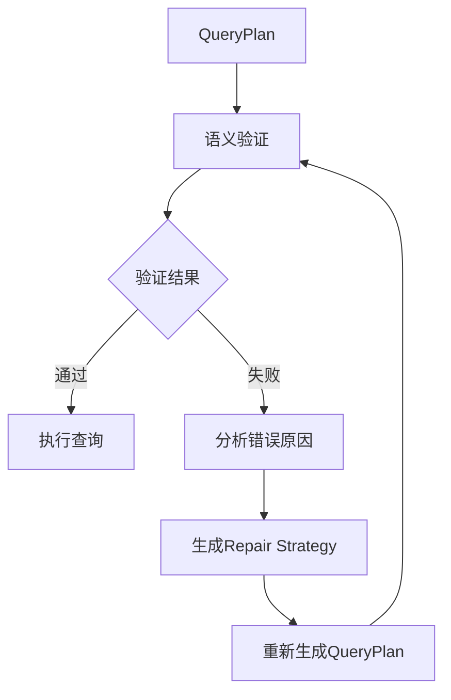


---

# 自动修复场景


## 场景1：字段不存在


原计划：

```
sales_amount

```


Metadata：

```
amount

```


修复：

```
sales_amount

↓

amount

```


---


## 场景2：指标聚合错误


错误：

```
SUM(CustomerCount)

```


修复：

```
COUNT(CustomerId)

```


---

# Phase 2.2.5 验收标准


完成：

✅

- 可以识别错误QueryPlan

- 可以定位错误原因

- 可以生成修复方案

- 可以重新验证


---


# 6.6 Phase 2.3 查询计划可靠性增强


状态：

🚧 当前开发


目标：

建立企业级 QueryPlan Intelligence。


主要方向：


1. 查询计划图模型

2. 查询计划解释能力

3. 查询质量评估体系

4. 高级SQL规划能力


---


# Phase 2.3.1 QueryPlan Graph


状态：

📌 开发中


## 当前问题


当前：

```
QueryPlan

 ├ Table

 ├ Column

 ├ Metric

 └ Filter

```


关系表达能力有限。


---

## 升级目标


构建：

```
QueryPlan Graph

```


架构：


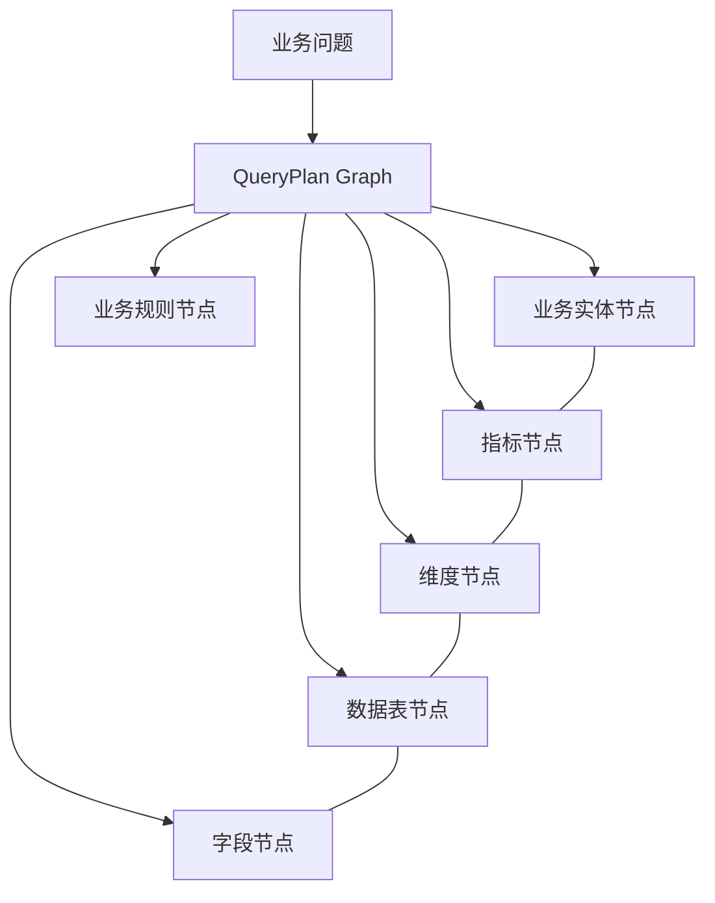


---

# Phase 2.3.2 QueryPlan Explainability


状态：

📌 规划


目标：

让AI解释查询逻辑。


例如：


用户：

> 查询华东地区销售趋势


AI解释：


```
选择订单表：

原因：

1. 包含销售金额字段

2. 包含订单日期字段

3. 包含区域字段


选择金额字段：

因为用户问题包含销售指标

```


---

# Phase 2.3.3 Query Evaluation Framework


状态：

📌 规划


目标：

建立查询质量评价体系。


架构：


评价指标：


|指标|说明|
|-|-|
|语义匹配度|是否理解业务问题|
|字段正确率|字段选择是否正确|
|SQL正确率|SQL是否执行成功|
|结果准确率|返回结果是否符合预期|


---

# Phase 2.3.4 Advanced SQL Builder


状态：

📌 规划


目标：

支持复杂企业分析场景。


增加：

- 多表关联
- 多维聚合
- 排序分析
- Top N分析
- 时间分析
- 趋势分析


架构：


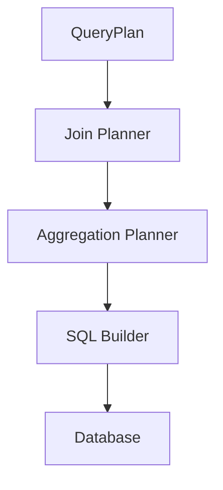


---

# Phase 2 总体验收标准


Phase 2完成后：

系统应该具备：


|能力|目标|
|-|-|
|查询规划|业务问题自动生成QueryPlan|
|语义验证|自动判断计划合理性|
|错误修复|自动调整错误计划|
|查询解释|说明AI决策过程|
|复杂分析|支持企业级分析场景|


---

# Phase 2完成标志


从：

```
AI SQL Generator

```


升级为：

```
AI Query Planning Engine

```


# 7. Phase 3 企业业务语义层


状态：

📌 规划阶段


# 7.1 阶段目标


Phase 1解决：

> AI能够理解数据库


Phase 2解决：

> AI能够可靠生成查询计划


Phase 3目标：

> AI能够理解企业业务本身


从：

```
数据库字段理解

```

升级为：

```
业务对象理解

```


例如：

数据库：

```
t_order

amount

create_time

customer_id

```


Phase 3后：

AI理解：


```
销售订单

销售金额

订单时间

客户关系

```


---

# 7.2 企业业务语义层总体架构


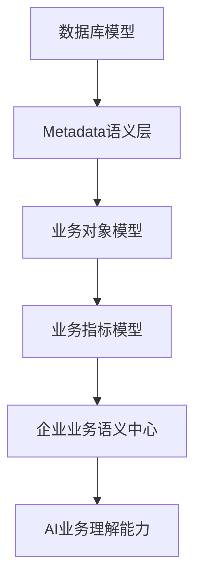


---

# 7.3 Phase 3.1 Business Entity Model


状态：

📌 规划


目标：

建立企业核心业务实体。


例如：


|业务实体|说明|
|-|-|
|Customer|客户|
|Product|产品|
|Order|订单|
|Contract|合同|
|Employee|员工|
|Revenue|收入|
|Cost|成本|


模型：


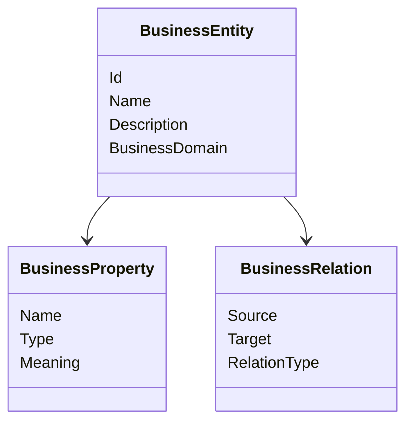


---

# 7.4 Phase 3.2 Business Metric Engine


状态：

📌 规划


目标：

建立企业统一指标体系。


解决问题：


同一个业务指标：

不同系统：

```
销售额

销售收入

营业收入

GMV

```

可能含义不同。


建立：


```
业务指标

↓

计算规则

↓

数据来源

↓

权限规则

```


架构：


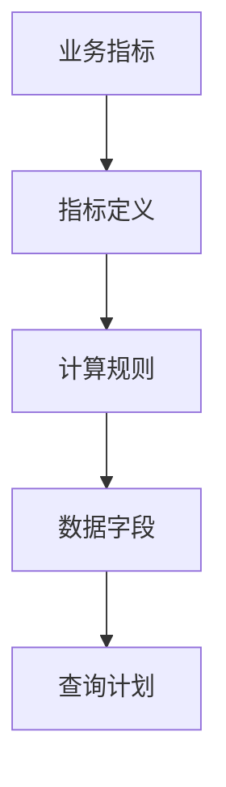


---

# 7.5 Phase 3.3 Semantic Knowledge Layer


状态：

📌 规划


目标：

建立企业业务语义中心。


结构：


```mermaid
graph TD


A[业务术语]


-->

B[业务指标]


-->

C[业务实体]


-->

D[数据字段]


-->

E[数据源]


```


价值：

- 提升AI理解能力
- 减少字段歧义
- 支持复杂业务分析


---

# Phase 3 验收标准


完成后：

AI应该能够理解：


```
查询华东区域客户价值变化

```


自动识别：


```
客户

+

区域

+

价值指标

+

时间变化

```


而不是：

简单匹配数据库字段。


---


# 8. Phase 4 企业知识图谱


状态：

📌 规划阶段


# 8.1 阶段目标


构建企业级知识网络。


从：

```
业务语义

```


进一步升级：


```
业务知识推理

```


---

# 8.2 企业知识图谱架构


```mermaid
graph TD


A[企业知识图谱]


A --> B[业务实体]

A --> C[业务关系]

A --> D[指标体系]

A --> E[业务规则]

A --> F[数据血缘]

A --> G[分析经验]


```


---

# 8.3 知识图谱能力


## 数据关系发现


例如：


AI发现：

```
客户

↓

订单

↓

产品

↓

收入


```


---

## 指标血缘分析


例如：


```
利润率


来源：


收入

-

成本


```


---

## 智能分析路径推荐


用户：

```
为什么利润下降？

```


AI自动规划：


```mermaid
flowchart TD


A[利润下降]


-->

B[分析收入]


-->

C[分析成本]


-->

D[分析客户]


-->

E[分析产品]


```


---

# Phase 4 验收标准


系统具备：


- 企业知识关系理解
- 自动分析路径推荐
- 指标关系推理
- 数据影响分析


---


# 9. Phase 5 AI Native BI Agent


状态：

📌 规划阶段


# 9.1 阶段目标


从：

```
AI查询助手

```


升级为：

```
AI业务分析专家

```


---

# 9.2 Agent总体架构


```mermaid
flowchart TD


A[AI BI Agent]


A --> B[Query Agent]

A --> C[Analysis Agent]

A --> D[Report Agent]

A --> E[Recommendation Agent]

A --> F[Decision Agent]


```


---

# 9.3 Query Agent


职责：

负责：

- 理解问题
- 创建查询计划
- 执行分析


---

# 9.4 Analysis Agent


职责：

自动发现：


- 趋势
- 异常
- 变化原因


流程：


```mermaid
flowchart TD


A[查询结果]


-->

B[趋势分析]


-->

C[异常检测]


-->

D[原因分析]


-->

E[业务结论]


```


---

# 9.5 Report Agent


能力：

自动生成：


- 分析报告
- 数据摘要
- 管理层汇报材料


---

# 9.6 Recommendation Agent


目标：

从：

```
发生什么？

```


升级：


```
应该怎么办？

```


例如：

```
销售下降

↓

发现原因

↓

建议调整区域策略

```


---

# Phase 5 验收标准


AI能够：

- 主动分析问题
- 自动生成报告
- 给出业务建议
- 支持连续对话


---


# 10. Phase 6 SuperBuilder AI Native Low-Code融合


状态：

📌 长期规划


# 10.1 阶段目标


将：

```
AI Native BI

```

融合：

```
AI Native Low-Code Platform

```


形成：

```
AI Enterprise Application Platform

```


---

# 10.2 平台融合架构


```mermaid
flowchart TD


A[用户业务需求]


-->

B[AI需求理解]


-->

C[应用生成Agent]


-->

D[页面生成]


D --> E[组件生成]


D --> F[数据模型生成]


B -->

G[BI分析Agent]


G -->

H[智能分析能力]


E -->

I[业务应用]


H -->

I


```


---

# 10.3 自动生成企业应用


用户：

```
创建销售管理系统

```


AI生成：

## 应用层

- 页面
- 表单
- 工作流


## 数据层

- 数据模型
- 数据关系


## 分析层

- BI指标
- 分析报表
- AI Agent


---

# Phase 6 最终目标


实现：

```
一句业务描述

↓

完整企业应用

↓

智能分析能力

↓

持续业务优化

```


---


# 11. 总体开发优先级


根据当前项目实际状态：

## P0 当前重点


# Phase 2.3 查询计划可靠性增强


优先开发：


1. QueryPlan Graph

2. QueryPlan Explainability

3. Query Evaluation Framework

4. Advanced SQL Builder


原因：

当前核心链路已经完成，需要提升企业可用性。


---


## P1 下一阶段


# Phase 3 企业业务语义层


重点：

- Business Entity
- Business Metric
- Semantic Knowledge


原因：

提升AI业务理解能力。


---

## P2 中长期建设


# Phase 4 企业知识图谱


重点：

- 企业知识沉淀
- 自动分析路径
- 业务推理


---

## P3 产品智能化


# Phase 5 AI Native BI Agent


重点：

- 主动分析
- 自动报告
- 决策辅助


---

## P4 平台战略方向


# Phase 6 AI Native Low-Code融合


重点：

打造：

> AI驱动的企业应用生成平台。


---


# 12. 项目最终目标


SuperBuilder AI Native BI最终目标：

不是成为一个新的报表工具。


而是成为：

> 企业级 AI Native Business Intelligence Agent Platform


最终能力：


```mermaid
flowchart TD


A[企业数据]


+

B[企业知识]


+

C[AI Agent]


+

D[Low-Code平台]


-->

E[AI Native Enterprise Platform]


```


最终实现：

用户只需要描述业务目标：

```
我要提升销售效率

```

系统自动完成：


```
理解目标

↓

分析数据

↓

发现问题

↓

生成方案

↓

创建应用

↓

持续优化

```


---


# 文档结束


版本：

SuperBuilder AI Native BI Phase Development Roadmap v2.0


当前状态：

Phase 2.3 查询计划可靠性增强

