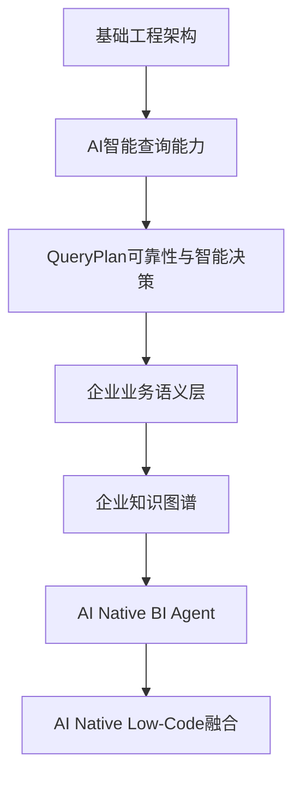
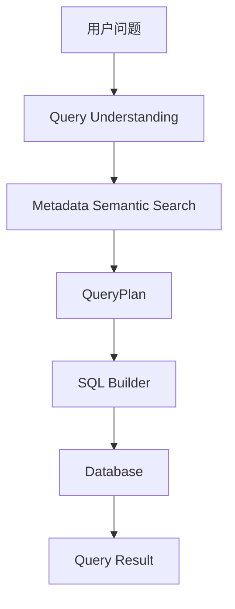
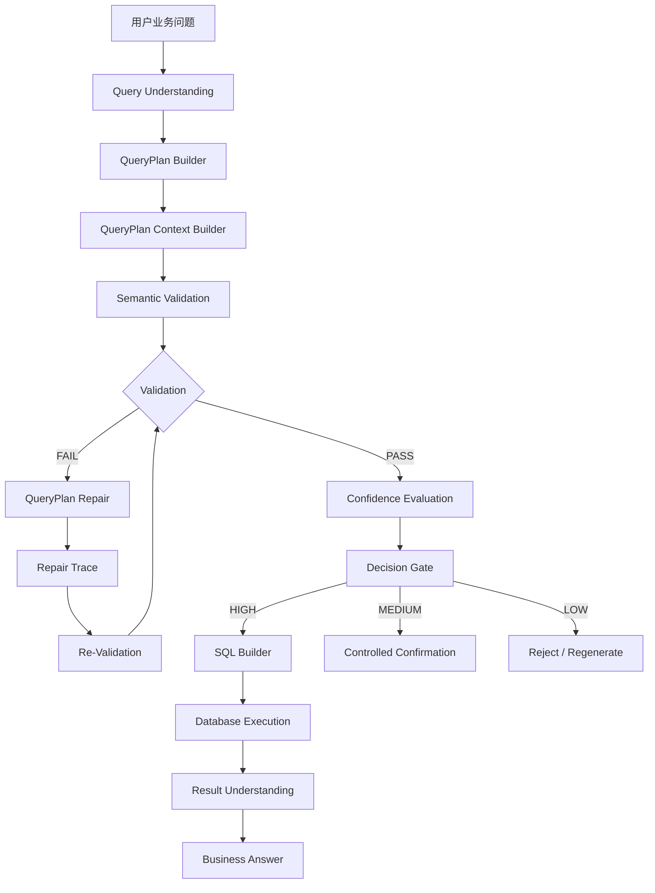
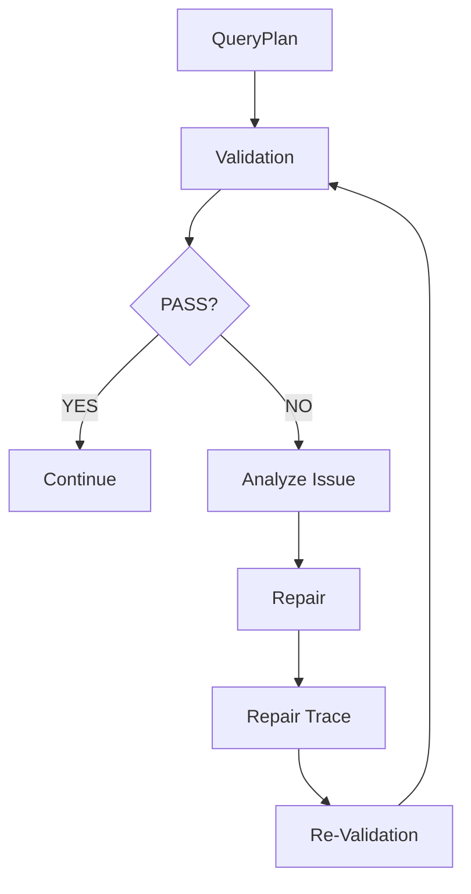
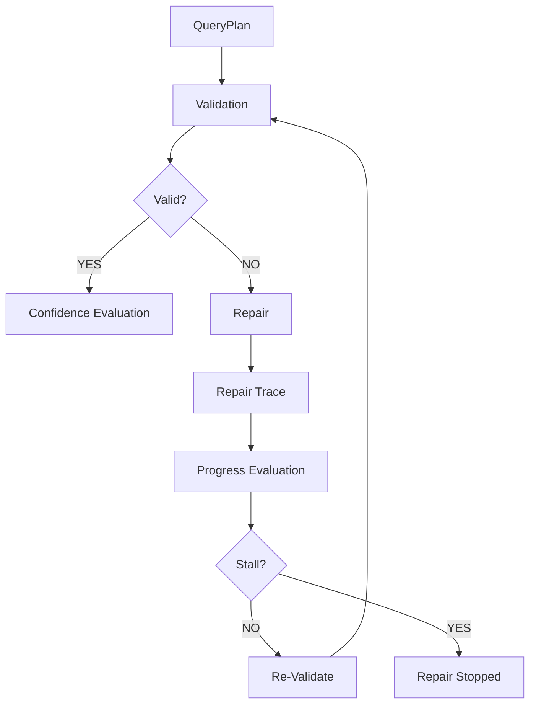
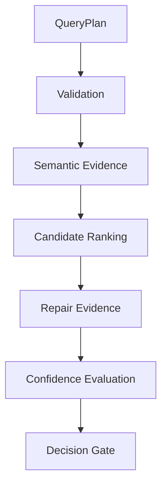
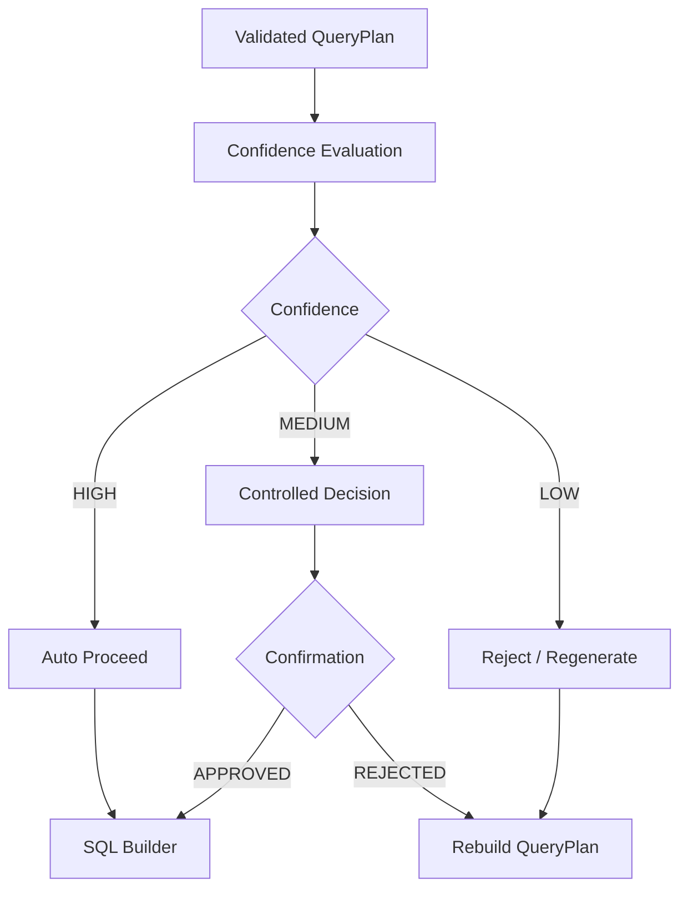
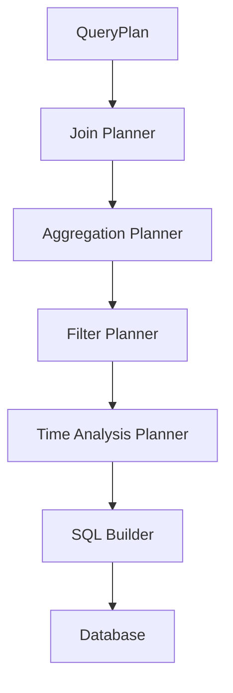
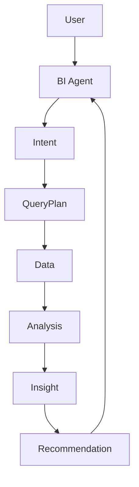
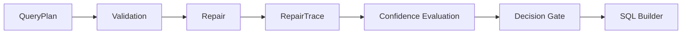

# 《SuperBuilder AI Native BI Phase开发计划（v2.1）》

````markdown
# SuperBuilder AI Native BI
# Phase开发计划（正式版）

版本：

v2.1


文档状态：

正式开发基线


当前开发阶段：

> Phase 2.4
> QueryPlan Confidence & Decision Gate


当前开发基线：

> Phase 2.3 QueryPlan Repair Reliability


当前源码基线：

> GitHub master


项目名称：

> SuperBuilder AI Native BI


---

# 目录

- [1. 项目定位](#1-项目定位)

- [2. 总体技术路线](#2-总体技术路线)

- [3. Phase开发总览](#3-phase开发总览)

- [4. 当前源码基线与阶段管理原则](#4-当前源码基线与阶段管理原则)

- [5. Phase 0 基础工程架构](#5-phase-0-基础工程架构)

- [6. Phase 1 AI智能查询核心能力](#6-phase-1-ai智能查询核心能力)

- [7. Phase 2 QueryPlan可靠性与智能决策](#7-phase-2-queryplan可靠性与智能决策)

- [8. Phase 2.1 QueryPlan基础能力](#8-phase-21-queryplan基础能力)

- [9. Phase 2.2 QueryPlan语义一致性验证](#9-phase-22-queryplan语义一致性验证)

- [10. Phase 2.2.5 QueryPlan自动修复](#10-phase-225-queryplan自动修复)

- [11. Phase 2.3 QueryPlan Repair Reliability](#11-phase-23-queryplan-repair-reliability)

- [12. Phase 2.4 QueryPlan Confidence & Decision Gate](#12-phase-24-queryplan-confidence--decision-gate)

- [13. Phase 2.5 QueryPlan Explainability](#13-phase-25-queryplan-explainability)

- [14. Phase 2.6 Query Evaluation Framework](#14-phase-26-query-evaluation-framework)

- [15. Phase 2.7 Advanced SQL Planning](#15-phase-27-advanced-sql-planning)

- [16. Phase 2 总体验收标准](#16-phase-2-总体验收标准)

- [17. Phase 3 企业业务语义层](#17-phase-3-企业业务语义层)

- [18. Phase 4 企业知识图谱](#18-phase-4-企业知识图谱)

- [19. Phase 5 AI Native BI Agent](#19-phase-5-ai-native-bi-agent)

- [20. Phase 6 AI Native Low-Code融合](#20-phase-6-ai-native-low-code融合)

- [21. 总体开发优先级](#21-总体开发优先级)

- [22. 阶段冻结与变更控制](#22-阶段冻结与变更控制)

- [23. 源码与文档一致性要求](#23-源码与文档一致性要求)

- [24. 当前阶段结论](#24-当前阶段结论)


---

# 1. 项目定位

SuperBuilder AI Native BI 是面向企业的数据智能分析平台。

区别于传统 BI：

```text
人工建模
    ↓
人工设计指标
    ↓
人工制作报表
    ↓
用户查看结果
````

SuperBuilder AI Native BI 的目标是：

```text
用户自然语言问题
        ↓
AI理解业务问题
        ↓
Metadata语义理解
        ↓
QueryPlan生成
        ↓
QueryPlan验证
        ↓
QueryPlan自动修复
        ↓
QueryPlan可信度判断
        ↓
Decision Gate
        ↓
SQL生成
        ↓
数据库执行
        ↓
结果理解
        ↓
业务回答
```

最终目标：

> 让企业用户通过自然语言直接与企业数据进行智能分析。

SuperBuilder AI Native BI 不仅需要做到：

> AI能够生成SQL

更需要逐步升级为：

> AI能够理解业务问题、规划查询、验证查询、修复查询、判断查询可信度、解释查询逻辑，并最终完成企业级业务分析。

---

# 2. 总体技术路线

SuperBuilder AI Native BI 的总体演进路线：



对应：

| 阶段      | 目标                   | 当前状态    |
| ------- | -------------------- | ------- |
| Phase 0 | 基础工程架构               | ✅ 已完成   |
| Phase 1 | AI智能查询核心能力           | ✅ 已完成   |
| Phase 2 | QueryPlan可靠性与智能决策    | 🚧 当前阶段 |
| Phase 3 | 企业业务语义层              | 📌 规划   |
| Phase 4 | 企业知识图谱               | 📌 规划   |
| Phase 5 | AI Native BI Agent   | 📌 规划   |
| Phase 6 | AI Native Low-Code融合 | 📌 规划   |

---

# 3. Phase开发总览

当前采用新的 Phase 2 结构：

```text
Phase 2
QueryPlan Reliability & Intelligence
│
├── Phase 2.1
│   QueryPlan Foundation
│
├── Phase 2.2
│   QueryPlan Semantic Validation
│
├── Phase 2.2.5
│   QueryPlan Auto Repair
│
├── Phase 2.3
│   QueryPlan Repair Reliability
│
├── Phase 2.4
│   QueryPlan Confidence & Decision Gate
│
├── Phase 2.5
│   QueryPlan Explainability
│
├── Phase 2.6
│   Query Evaluation Framework
│
└── Phase 2.7
    Advanced SQL Planning
```

完整演进：

```text
用户问题
    ↓
Query Understanding
    ↓
Metadata Semantic Search
    ↓
QueryPlan
    ↓
Validation
    ↓
Repair
    ↓
Repair Trace
    ↓
Confidence Evaluation
    ↓
Decision Gate
    ↓
SQL Builder
    ↓
Execution
    ↓
Result Understanding
    ↓
Business Answer
```

Phase 2 完成之后：

```text
AI SQL Generator
```

升级为：

```text
AI Query Planning Engine
```

进一步升级为：

```text
AI Reliable Query Decision Engine
```

---

# 4. 当前源码基线与阶段管理原则

## 4.1 源码事实原则

本项目所有开发阶段判断必须以：

> GitHub master 最新源码

为第一事实来源。

禁止仅依据：

* 设计文档
* 架构图
* 历史讨论
* README
* 过去版本
* 代码规划

判断某项功能已经完成。

---

## 4.2 功能完成定义

一个功能只有同时满足以下条件，才可以标记：

```text
✅ 已完成
```

至少需要确认：

1. 核心模型存在
2. 核心接口存在
3. 核心实现存在
4. Dependency Injection 已接入
5. 实际调用链存在
6. 编译关系正确
7. 没有明显的设计/代码断层

如果只有：

```text
接口存在
```

不能标记完成。

如果只有：

```text模型存在
```

不能标记完成。

如果只有：

```text架构设计存在
```

不能标记完成。

---

## 4.3 当前源码基线

当前正式源码基线：

```text
master
```

当前 Phase 基线：

```text
Phase 2.3
QueryPlan Repair Reliability
```

当前下一开发阶段：

```text
Phase 2.4
QueryPlan Confidence & Decision Gate
```

---

## 4.4 阶段推进原则

每个 Phase 必须经历：

```text
设计
 ↓
实现
 ↓
编译
 ↓
链路验证
 ↓
源码检查
 ↓
验收
 ↓
冻结
 ↓
进入下一 Phase
```

禁止：

```text
设计完成
 ↓
直接宣布完成
```

---

# 5. Phase 0 基础工程架构

状态：

> ✅ 已完成

## 5.1 阶段目标

建立企业级应用基础架构。

---

## 5.2 完成内容

### 应用架构

建立：

```text
Controller
    ↓
Application
    ↓
Domain
    ↓
Infrastructure
    ↓
Database
```

包括：

* 分层架构
* 服务接口设计
* Dependency Injection
* 数据访问层
* 配置管理
* 数据库访问基础能力

---

## 5.3 数据库支持

目标数据库：

* SQL Server
* MySQL
* PostgreSQL

---

## 5.4 Phase 0 验收标准

满足：

* 项目可以正常构建
* 基础依赖注入可用
* 数据库访问链路可用
* 多数据库基础架构存在
* Application / Domain / Infrastructure 边界清晰

状态：

> ✅ 已完成

---

# 6. Phase 1 AI智能查询核心能力

状态：

> ✅ 已完成

## 6.1 阶段目标

实现：

> 用户输入自然语言业务问题，AI能够自动完成基础数据查询。

---

## 6.2 核心流程



---

# 6.3 Phase 1.1 Query Understanding

状态：

> ✅ 已完成

目标：

识别：

* 用户意图
* 查询目标
* 指标
* 条件
* 分析维度

核心对象：

```text
QueryIntent
QueryMetric
QueryFilter
QueryDimension
```

---

# 6.4 Phase 1.2 Metadata Semantic

状态：

> ✅ 已完成

流程：

```text
Database Schema
    ↓
Metadata Scanner
    ↓
Metadata Semantic
    ↓
Embedding
    ↓
Vector Database
    ↓
Semantic Search
```

目标：

> 让AI理解数据库字段背后的业务语义。

---

# 6.5 Phase 1.3 QueryPlan

状态：

> ✅ 已完成

建立 SQL 之前的业务规划层：

```text
QueryIntent
    ↓
QueryPlan
    ↓
SQL Builder
```

QueryPlan至少描述：

* 查询目标
* 数据来源
* 指标
* 维度
* 过滤条件
* 关联关系

---

# 6.6 Phase 1.4 SQL / Execution

状态：

> ✅ 基础能力完成

基础链路：

```text
QueryPlan
    ↓
SQL Builder
    ↓
SQL
    ↓
Connection Factory
    ↓
Database
    ↓
Query Result
```

---

# 6.7 Phase 1 验收标准

满足：

1. 可以理解用户自然语言问题
2. 可以搜索Metadata语义
3. 可以生成QueryPlan
4. 可以生成SQL
5. 可以连接数据库
6. 可以执行基础查询
7. 可以返回查询结果

状态：

> ✅ 已完成

---

# 7. Phase 2 QueryPlan可靠性与智能决策

状态：

> 🚧 当前阶段

## 7.1 阶段目标

Phase 1解决：

> AI能够查询数据。

Phase 2解决：

> AI能够生成可信查询。

核心升级：

```text
能够生成查询
        ↓
能够验证查询
        ↓
能够修复查询
        ↓
能够追踪修复
        ↓
能够判断查询可信度
        ↓
能够决定是否允许进入SQL Builder
```

---

# 7.2 Phase 2 总体架构



---

# 7.3 Phase 2 核心原则

Phase 2 不再采用：

```text
Validation PASS
=
高置信度
```

而采用：

```text
Validation
+
Semantic Evidence
+
Candidate Ranking
+
Repair History
+
Repair Stability
+
Plan Completeness
=
Confidence
```

因此：

> Validation 是必要条件之一，但不是 Confidence 的全部。

---

# 8. Phase 2.1 QueryPlan基础能力

状态：

> ✅ 已完成

## 8.1 阶段目标

建立 AI 与 SQL 之间稳定的业务规划层。

---

## 8.2 核心模型

```text
QueryPlan
QueryIntent
QueryMetric
QueryFilter
QueryDimension
QueryTable
QueryField
QueryJoin
QueryAggregation
```

---

## 8.3 QueryPlan职责

QueryPlan负责描述：

```text
用户想查询什么
        ↓
使用哪些数据
        ↓
使用哪些字段
        ↓
使用哪些指标
        ↓
使用哪些维度
        ↓
使用哪些过滤条件
        ↓
如何关联数据
```

---

## 8.4 Phase 2.1 验收标准

满足：

* QueryPlan结构化
* QueryIntent可关联
* Metric可关联
* Filter可关联
* Dimension可关联
* Table可关联
* Field可关联
* 后续模块能够消费QueryPlan

状态：

> ✅ 已完成

---

# 9. Phase 2.2 QueryPlan语义一致性验证

状态：

> ✅ 已完成

## 9.1 阶段目标

验证：

> AI生成的QueryPlan是否符合Metadata与业务语义。

---

## 9.2 QueryPlan Context

流程：

```text
QueryPlan
    ↓
Metadata
    ↓
Column Semantic
    ↓
Metric Semantic
    ↓
Validation Context
```

---

## 9.3 Validator

主要验证：

### Metric

检查：

* 指标是否存在
* 聚合是否合理
* 指标与字段是否匹配

### Dimension

检查：

* 维度字段是否合法
* 是否适合作为分析维度

### Filter

检查：

* 字段类型
* 操作符
* 参数类型

### Table

检查：

* 表是否存在
* 表是否属于当前DataSource

### Field

检查：

* 字段是否存在
* 字段与语义是否匹配

---

## 9.4 Validation Result

验证结果至少应该区分：

```text
PASS
WARNING
ERROR
```

并记录：

```text
Issue
Severity
Field
Metric
Dimension
Filter
Reason
```

---

## 9.5 Phase 2.2 验收标准

满足：

* Context Builder存在
* Semantic Validator存在
* Metadata验证存在
* Metric验证存在
* Field验证存在
* Filter验证存在
* Validation Result可表达错误
* Validation Pipeline可组织验证过程

状态：

> ✅ 已完成

---

# 10. Phase 2.2.5 QueryPlan自动修复

状态：

> ✅ 已完成

## 10.1 阶段目标

当QueryPlan存在错误时：

```text
Validation Failed
        ↓
分析错误
        ↓
生成Repair Strategy
        ↓
修改QueryPlan
        ↓
重新Validation
```

---

## 10.2 自动修复场景

### 场景1：字段不存在

```text
sales_amount
```

Metadata：

```text
amount
```

修复：

```text
sales_amount
    ↓
amount
```

---

### 场景2：指标聚合错误

```text
SUM(CustomerId)
```

修复：

```text
COUNT(CustomerId)
```

---

### 场景3：字段匹配错误

```text
用户问题
    ↓
错误字段
    ↓
Semantic Candidate Search
    ↓
Candidate Ranking
    ↓
替换字段
```

---

## 10.3 Repair Loop



---

## 10.4 Phase 2.2.5 验收标准

满足：

* 可以识别错误QueryPlan
* 可以定位错误原因
* 可以生成修复方案
* 可以执行修复
* 可以重新验证
* 修复过程不会无限循环

状态：

> ✅ 已完成

---

# 11. Phase 2.3 QueryPlan Repair Reliability

状态：

> ✅ 已完成 / 当前冻结基线

## 11.1 阶段定位

Phase 2.3 不再定义为原计划中的：

```text
QueryPlan Graph
QueryPlan Explainability
Query Evaluation
Advanced SQL Builder
```

而正式定义为：

> QueryPlan Repair Reliability

原因：

当前实际代码已经将 QueryPlan Repair 从简单的：

```text
修复一次
```

升级为：

```text
Repair
 ↓
Repair Result
 ↓
Repair Trace
 ↓
Repair History
 ↓
Repair Progress
 ↓
Stall Detection
 ↓
Re-Validation
```

因此需要把这些实际能力统一纳入一个稳定阶段。

---

# 11.2 Phase 2.3 目标

建立：

> 可追踪、可判断、可停止、可审计的 QueryPlan Repair 机制。

---

# 11.3 Repair Result

Repair必须能够表达：

```text
是否发生Repair
Repair Action
Repair Target
Repair Reason
Before
After
Repair Result
```

---

# 11.4 Repair Trace

Repair Trace 用于记录：

```text
Repair Start
    ↓
Issue
    ↓
Repair Action
    ↓
Candidate
    ↓
Selected Candidate
    ↓
Plan Change
    ↓
Validation
    ↓
Repair Result
```

目标：

> 让系统能够回答“AI到底修改了什么”。

---

# 11.5 Repair History

一个QueryPlan可能经历：

```text
Plan V1
    ↓
Repair V1
    ↓
Plan V2
    ↓
Repair V2
    ↓
Plan V3
```

因此需要保留：

```text
Version
Repair Count
Previous State
Current State
Repair Action
Validation Result
```

---

# 11.6 Repair Progress

Repair不是：

```text
只要Validation最终PASS就算成功
```

还需要判断：

```text
每次Repair是否真正改善QueryPlan
```

例如：

```text
V1
Error = 5

↓

V2
Error = 3

↓

V3
Error = 1

↓

V4
Error = 0
```

这是有效进展。

---

# 11.7 Repair Stall

必须识别：

```text
V1
Error = 2

↓

V2
Error = 2

↓

V3
Error = 2
```

这种情况：

> Repair发生了，但QueryPlan没有实质改善。

系统必须能够判定：

```text
STALL
```

并停止无限Repair。

---

# 11.8 Phase 2.3 总体闭环



---

# 11.9 Phase 2.3 验收标准

必须满足：

* Repair Result
* Repair Trace
* Repair History
* Repair Progress
* Stall Detection
* Re-Validation
* Repair Loop控制
* Repair过程可解释

最终状态：

> QueryPlan Repair Reliability 已形成稳定闭环。

状态：

> ✅ 已冻结

---

# 12. Phase 2.4 QueryPlan Confidence & Decision Gate

状态：

> ✅ 已完成 / 已冻结

## 12.1 阶段目标

回答：

> 一个已经经过Validation / Repair的QueryPlan，到底有多大把握可以进入SQL Builder？

核心目标：

建立：

```text
QueryPlan
    ↓
Confidence Evaluation
    ↓
Decision Gate
```

---

# 12.2 为什么需要Confidence

不能采用：

```text
Validation PASS
        ↓
直接SQL Builder
```

因为：

> Validation PASS ≠ High Confidence

一个QueryPlan可能验证通过，但：

* Semantic Candidate分数较低
* Table Match不稳定
* Field Match较弱
* Metric Match存在歧义
* Dimension选择存在多个候选
* Filter经过多次Repair
* Repair次数过多
* Repair发生Stall
* RepairTrace最终状态不理想

因此需要独立Confidence层。

---

# 12.3 Confidence总体模型



---

# 12.4 Confidence输入因素

Confidence必须至少考虑以下因素：

## 1. Metadata Semantic Match

判断：

> QueryPlan与Metadata语义之间的匹配程度。

---

## 2. Table Match

判断：

> QueryPlan选择的数据表是否与用户问题高度匹配。

---

## 3. Field Match

判断：

> QueryPlan选择的字段是否与业务语义匹配。

---

## 4. Metric Match

判断：

> 指标选择是否正确。

包括：

* Metric名称
* Metric语义
* Aggregation
* Source Field

---

## 5. Dimension Match

判断：

> 分析维度是否与用户问题匹配。

---

## 6. Filter Match

判断：

> 查询条件是否与用户问题一致。

包括：

* Field
* Operator
* Value
* Data Type

---

## 7. Validation Quality

不能只判断：

```text
PASS / FAIL
```

还需要判断：

```text
Original Validation Issues
Remaining Issues
Warning Count
Error Count
```

---

## 8. Repair Count

记录：

```text
RepairCount
```

一般情况下：

```text
RepairCount = 0
```

可信度应高于：

```text
RepairCount = 5
```

但不能简单规定：

> Repair次数越多，Confidence一定越低。

因为有效Repair可能提高最终质量。

因此Repair Count只能作为一个因素。

---

## 9. Repair Progress

判断Repair是否持续改善：

```text
Error Count

5
 ↓
3
 ↓
1
 ↓
0
```

这种Repair应当被认为具有积极证据。

---

## 10. Repair Stall

如果：

```text
Repair
 ↓
没有改善
 ↓
Repair
 ↓
没有改善
```

必须降低Confidence。

---

## 11. RepairTrace最终状态

RepairTrace至少需要能够表达：

```text
NotRepaired
Repaired
RepairedAndValidated
Stalled
Failed
```

最终状态必须参与Confidence。

---

# 12.5 Confidence模型

建议建立统一模型：

```text
QueryPlanConfidence
```

至少包括：

```text
OverallScore

SemanticScore

TableMatchScore

FieldMatchScore

MetricMatchScore

DimensionMatchScore

FilterMatchScore

ValidationScore

RepairScore

RepairStabilityScore

TraceScore
```

---

# 12.6 Confidence等级

定义：

```text
HIGH
MEDIUM
LOW
```

---

# 12.7 HIGH

特点：

```text
语义匹配强
+
表匹配强
+
字段匹配强
+
指标匹配强
+
维度匹配强
+
Filter匹配强
+
Validation稳定
+
Repair次数合理
+
没有Stall
+
RepairTrace状态正常
```

决策：

```text
HIGH
 ↓
自动进入SQL Builder
```

---

# 12.8 MEDIUM

特点：

```text
QueryPlan基本合理
但存在一定不确定性
```

例如：

```text
存在多个Candidate
语义分数中等
发生少量Repair
存在Warning
```

决策：

```text
MEDIUM
 ↓
Controlled Decision
```

根据业务场景可以：

```text
再次Semantic Search
```

或者：

```text
要求用户确认
```

或者：

```text
受控进入SQL Builder
```

---

# 12.9 LOW

特点：

```text
语义匹配弱
+
字段匹配弱
+
指标不明确
+
Repair次数过多
+
Repair Stall
+
Trace Failed
```

决策：

```text
LOW
 ↓
拒绝进入SQL Builder
```

可以：

```text
重新Query Understanding
```

或者：

```text
重新Semantic Search
```

或者：

```text
请求用户澄清
```

---

# 12.10 Decision Gate

最终架构：



---

# 12.11 Decision Gate原则

Decision Gate必须是：

> SQL Builder之前的最后一道业务可靠性门。

即：

```text
QueryPlan
 ↓
Validation
 ↓
Repair
 ↓
Confidence
 ↓
Decision Gate
 ↓
SQL Builder
```

不能：

```text
QueryPlan
 ↓
SQL Builder
 ↓
Confidence
```

因为SQL已经生成以后，再判断QueryPlan是否可信，价值已经降低。

---

# 12.12 Phase 2.4 不负责的内容

Phase 2.4 不负责：

* 企业业务知识图谱
* 企业指标中心
* Business Entity Model
* BI Agent
* Low-Code Component Runtime
* Advanced SQL完整实现
* 企业知识推理

这些属于后续阶段。

---

# 12.13 Phase 2.4 验收标准

必须满足：

1. 存在QueryPlanConfidence模型
2. 存在Confidence Evaluation Service
3. 可以计算OverallScore
4. 可以计算Semantic Match
5. 可以计算Table Match
6. 可以计算Field Match
7. 可以计算Metric Match
8. 可以计算Dimension Match
9. 可以计算Filter Match
10. 可以考虑Validation结果
11. 可以考虑Repair Count
12. 可以考虑Repair Progress
13. 可以识别Repair Stall
14. 可以读取RepairTrace最终状态
15. 可以生成HIGH / MEDIUM / LOW
16. 存在Decision Gate
17. HIGH可以自动进入SQL Builder
18. MEDIUM进入受控流程
19. LOW禁止直接执行
20. Decision Gate有完整Trace

Phase 2.4完成标志：

> QueryPlan不再只是“验证通过”，而是能够被系统量化判断“是否值得信任”。

---

# 13. Phase 2.5 QueryPlan Explainability

状态：

> 📌 规划

## 13.1 阶段目标

让AI能够解释：

> 为什么选择这个QueryPlan？

---

## 13.2 解释内容

例如用户：

> 查询华东地区销售趋势。

AI应该能够解释：

```text
选择订单表：

原因：
1. 包含销售金额
2. 包含订单日期
3. 包含区域信息

选择销售金额：

因为用户问题包含销售指标。

选择订单日期：

因为用户要求趋势分析。

选择区域字段：

因为用户指定华东地区。
```

---

## 13.3 Explainability模型

建议：

```text
QueryPlanExplanation
```

包括：

```text
TableReason
FieldReason
MetricReason
DimensionReason
FilterReason
JoinReason
RepairReason
ConfidenceReason
```

---

## 13.4 Phase 2.5 验收标准

系统能够回答：

```text
为什么选择这个表？
为什么选择这个字段？
为什么选择这个指标？
为什么选择这个维度？
为什么使用这个过滤条件？
为什么进行了Repair？
为什么这个QueryPlan是HIGH Confidence？
```

状态：

> 📌 规划

---

# 14. Phase 2.6 Query Evaluation Framework

状态：

> 📌 规划

## 14.1 阶段目标

建立：

> QueryPlan质量评价体系。

---

## 14.2 Evaluation Pipeline


---

## 14.3 评价指标

| 指标                     | 说明             |
| ---------------------- | -------------- |
| Semantic Match         | 业务语义是否正确       |
| Table Accuracy         | 表选择是否正确        |
| Field Accuracy         | 字段选择是否正确       |
| Metric Accuracy        | 指标是否正确         |
| Dimension Accuracy     | 维度是否正确         |
| Filter Accuracy        | 条件是否正确         |
| SQL Accuracy           | SQL是否正确        |
| Execution Success      | SQL是否能够执行      |
| Result Accuracy        | 查询结果是否正确       |
| Confidence Calibration | Confidence是否可靠 |

---

## 14.4 Confidence Calibration

重点验证：

```text
HIGH
```

是否真的比：

```text
MEDIUM
```

更可靠。

以及：

```text
LOW
```

是否真的具有较高错误概率。

最终目标：

> Confidence不仅能够评分，还要能够被数据证明有效。

---

# 14.5 Phase 2.6 验收标准

建立：

* Query Dataset
* Expected QueryPlan
* Evaluation Engine
* Accuracy Metrics
* Confidence Calibration
* Regression Test

状态：

> 📌 规划

---

# 15. Phase 2.7 Advanced SQL Planning

状态：

> 📌 规划

## 15.1 阶段目标

支持复杂企业分析场景。

---

## 15.2 支持能力

包括：

* 多表关联
* Join Planning
* 多维聚合
* 排序
* Top N
* 时间分析
* 趋势分析
* 同比
* 环比
* 分组分析
* 条件聚合
* 子查询
* CTE
* 窗口函数

---

## 15.3 Advanced SQL Architecture



---

## 15.4 Phase 2.7原则

Advanced SQL必须建立在：

```text
Validated QueryPlan
+
Confidence
+
Decision Gate
```

之后。

不能为了支持复杂SQL而绕过：

```text
Validation
Repair
Confidence
Decision Gate
```

---

# 16. Phase 2 总体验收标准

Phase 2完成后，系统应该具备：

| 能力                  | 目标             |
| ------------------- | -------------- |
| QueryPlan           | 自动生成业务查询计划     |
| Semantic Validation | 自动验证业务一致性      |
| QueryPlan Repair    | 自动修复错误计划       |
| Repair Trace        | 记录修复过程         |
| Repair History      | 保存修复历史         |
| Repair Progress     | 判断修复是否改善       |
| Stall Detection     | 防止无效Repair循环   |
| Confidence          | 判断QueryPlan可信度 |
| Decision Gate       | 控制是否允许进入SQL    |
| Explainability      | 解释AI决策         |
| Evaluation          | 评价QueryPlan质量  |
| Advanced SQL        | 支持复杂分析         |

最终形成：

```text
User Question
    ↓
Query Understanding
    ↓
Metadata Semantic Search
    ↓
QueryPlan
    ↓
Validation
    ↓
Repair
    ↓
Repair Trace
    ↓
Confidence
    ↓
Decision Gate
    ↓
Advanced SQL Planning
    ↓
SQL Builder
    ↓
Execution
    ↓
Result Understanding
    ↓
Business Answer
```

Phase 2最终目标：

> 从 AI SQL Generator 升级为 AI Reliable Query Planning Engine。

---

# 17. Phase 3 企业业务语义层

状态：

> 📌 规划阶段

## 17.1 阶段目标

Phase 1：

> AI能够理解数据库。

Phase 2：

> AI能够可靠生成QueryPlan。

Phase 3：

> AI能够理解企业业务本身。

---

## 17.2 核心升级

从：

```text
Database Field
```

升级为：

```text
Business Object
```

例如：

数据库：

```text
t_order

amount

create_time

customer_id
```

Phase 3：

```text
销售订单

销售金额

订单时间

客户关系
```

---

# 17.3 Phase 3.1 Business Entity Model

目标：

建立企业业务实体。

例如：

```text
Customer
Product
Order
Contract
Employee
Revenue
Cost
```

模型：

```text
BusinessEntity
BusinessProperty
BusinessRelation
```

---

# 17.4 Phase 3.2 Business Metric Engine

建立：

```text
Business Metric
    ↓
Metric Definition
    ↓
Calculation Rule
    ↓
Data Source
    ↓
QueryPlan
```

目标：

解决：

```text
销售额
销售收入
营业收入
GMV
```

之间的业务定义差异。

---

# 17.5 Phase 3.3 Semantic Knowledge Layer

建立：

```text
Business Term
    ↓
Business Metric
    ↓
Business Entity
    ↓
Data Field
    ↓
Data Source
```

---

# 17.6 Phase 3原则

Phase 3不能提前在 Phase 2 中大规模实现。

Phase 2重点是：

> QueryPlan Reliability & Intelligence

Phase 3重点是：

> Enterprise Business Semantic Understanding

---

# 17.7 Phase 3验收标准

AI能够理解：

```text
查询华东区域客户价值变化
```

并识别：

```text
客户
+
区域
+
价值指标
+
时间变化
```

而不是简单进行数据库字段匹配。

---

# 18. Phase 4 企业知识图谱

状态：

> 📌 规划阶段

## 18.1 阶段目标

从：

```text
Business Semantic
```

进一步升级：

```text
Business Knowledge Reasoning
```

---

## 18.2 企业知识图谱

包括：

```text
Business Entity
Business Relation
Business Metric
Business Rule
Data Lineage
Analysis Experience
```

---

## 18.3 核心能力

包括：

* 企业知识关联
* 业务关系推理
* 指标关系推理
* 数据血缘
* 业务规则
* 分析经验复用

---

# 19. Phase 5 AI Native BI Agent

状态：

> 📌 规划阶段

## 19.1 阶段目标

从：

```text
AI Query Engine
```

升级为：

```text
AI BI Agent
```

---

## 19.2 Agent能力

Agent可以：

```text
理解问题
 ↓
规划任务
 ↓
查询数据
 ↓
分析结果
 ↓
发现异常
 ↓
生成洞察
 ↓
提出建议
 ↓
继续追问
```

---

## 19.3 Agent工作模式



---

# 20. Phase 6 AI Native Low-Code融合

状态：

> 📌 规划阶段

## 20.1 阶段目标

将：

```text
AI Native BI
```

与：

```text
AI Native Low-Code
```

融合。

---

## 20.2 总体目标

最终形成：

```text
Natural Language
        ↓
AI Understanding
        ↓
Business Semantic
        ↓
QueryPlan
        ↓
Data Analysis
        ↓
AI Insight
        ↓
AI Generated UI
        ↓
User Defined Component
        ↓
Application
```

---

## 20.3 AI Native Low-Code方向

包括：

* AI生成页面
* AI生成组件
* AI生成数据模型
* AI生成查询
* AI生成BI分析
* 用户自定义组件
* Component Runtime
* Dynamic Rendering
* Component Library
* AI Generated Components

---

## 20.4 最终平台

最终SuperBuilder目标：

```text
AI Native BI
        +
AI Native Low-Code
        +
User Defined Components
        +
Business Semantic
        +
AI Agent
```

形成：

> AI Native Enterprise Application Platform

---

# 21. 总体开发优先级

当前开发优先级必须严格按照：

```text
P0
Phase 2.3 冻结
        ↓
P1
Phase 2.4 Confidence & Decision Gate
        ↓
P2
Phase 2.5 Explainability
        ↓
P3
Phase 2.6 Evaluation
        ↓
P4
Phase 2.7 Advanced SQL Planning
        ↓
P5
Phase 3 Business Semantic
        ↓
P6
Phase 4 Knowledge Graph
        ↓
P7
Phase 5 BI Agent
        ↓
P8
Phase 6 AI Native Low-Code
```

---

# 21.1 当前禁止事项

在 Phase 2.4 完成之前：

禁止提前进入：

```text
Phase 3 Business Entity Model
```

禁止大规模建设：

```text
Business Metric Engine
Knowledge Graph
BI Agent
Low-Code融合
```

---

# 21.2 当前允许的技术债处理

允许处理：

* 编译错误
* 接口不一致
* Namespace错误
* DI注册问题
* 已实现功能的Bug
* 当前Phase所需的重构
* 当前Phase所需的测试

但禁止借“修Bug”名义提前实现下一Phase的大功能。

---

# 22. 阶段冻结与变更控制

每个Phase完成后必须冻结。

冻结流程：

```text
Implementation
    ↓
Build
    ↓
Integration
    ↓
Code Review
    ↓
Acceptance
    ↓
Git Commit
    ↓
Master
    ↓
Phase Frozen
```

---

## 22.1 Phase冻结条件

一个Phase只有满足：

```text
代码完成
+
调用链完成
+
构建通过
+
验收通过
+
文档同步
+
Master基线建立
```

才能宣布：

> Phase Complete

---

# 22.2 Phase变更规则

如果开发过程中发现：

```text
实际代码路线
≠
原开发计划
```

不得继续累积偏差。

必须：

```text
发现偏差
 ↓
记录偏差
 ↓
分析原因
 ↓
重新定义Phase
 ↓
更新Phase文档
 ↓
重新建立基线
```

---

# 23. 源码与文档一致性要求

本项目今后所有阶段文档必须遵守：

> 文档描述不能超过源码实际能力。

---

## 23.1 禁止

禁止出现：

```text
文档：
QueryPlan Confidence 已完成

源码：
没有Confidence Service
```

这种情况。

---

## 23.2 必须

如果功能只是规划：

```text
📌 规划
```

如果开发中：

```text
🚧 开发中
```

如果基础能力已经存在但还没有完整验收：

```text
🟡 基础完成
```

如果完整验收：

```text
✅ 已完成
```

---

# 23.3 源码映射要求

重要功能必须可以映射到：

```text
Project
    ↓
Namespace
    ↓
File
    ↓
Class
    ↓
Interface
    ↓
Method
    ↓
Call Chain
```

例如：

```text
QueryPlan Repair
        ↓
QueryPlanRepairService
        ↓
IQueryPlanRepairService
        ↓
Validation Result
        ↓
Repair
        ↓
Re-Validation
```

---

# 24. 当前阶段结论

## 24.1 当前项目总体阶段

```text
Phase 2
QueryPlan Reliability & Intelligence
```

---

## 24.2 Phase 2.3状态

```text
Phase 2.3
QueryPlan Repair Reliability
```

当前作为：

> **已完成并冻结的开发基线**

其核心能力包括：

```text
QueryPlan Repair
        ↓
Repair Result
        ↓
Repair Trace
        ↓
Repair History
        ↓
Repair Progress
        ↓
Stall Detection
        ↓
Re-Validation
```

---

# 24.3 下一阶段

正式进入：

> # Phase 2.4
>
> # QueryPlan Confidence & Decision Gate

---

# 24.4 Phase 2.4核心问题

Phase 2.4只回答一个核心问题：

> 一个QueryPlan修复完成以后，到底有多大把握可以进入SQL Builder？

---

# 24.5 Phase 2.4核心链路



---

# 24.6 Confidence核心输入

```text
Metadata Semantic Match
Table Match
Field Match
Metric Match
Dimension Match
Filter Match
Validation Quality
Repair Count
Repair Progress
Repair Stall
RepairTrace Final State
Candidate Ranking Score
```

---

# 24.7 Decision结果

```text
HIGH
 ↓
自动进入SQL Builder
```

```text
MEDIUM
 ↓
受控确认 / 受控继续
```

```text
LOW
 ↓
拒绝执行 / 重新规划
```

---

# 24.8 当前明确禁止

当前：

> 不进入 Phase 3。

当前：

> 不大规模开发企业业务语义层。

当前：

> 不进入 Knowledge Graph。

当前：

> 不进入 BI Agent。

当前：

> 不进入 AI Native Low-Code融合。

当前：

> 不把 Advanced SQL Builder 作为下一阶段优先开发目标。

---

# 24.9 当前开发基线

当前完成阶段：Phase 2.4
当前冻结阶段：Phase 2.4
下一开发阶段：Phase 2.5 Explainability

---

# 24.10 最终路线

SuperBuilder AI Native BI 的正式路线：

```text
Phase 0
基础工程
    ↓
Phase 1
AI智能查询
    ↓
Phase 2.1
QueryPlan
    ↓
Phase 2.2
Semantic Validation
    ↓
Phase 2.2.5
Auto Repair
    ↓
Phase 2.3
Repair Reliability
    ↓
Phase 2.4
Confidence & Decision Gate
    ↓
Phase 2.5
Explainability
    ↓
Phase 2.6
Evaluation
    ↓
Phase 2.7
Advanced SQL Planning
    ↓
Phase 3
Enterprise Business Semantic
    ↓
Phase 4
Enterprise Knowledge Graph
    ↓
Phase 5
AI Native BI Agent
    ↓
Phase 6
AI Native Low-Code
```

最终目标：

```text
AI SQL Generator
        ↓
AI Query Planning Engine
        ↓
AI Reliable Query Planning Engine
        ↓
AI Business Intelligence Engine
        ↓
AI Native BI Agent
        ↓
AI Native Enterprise Application Platform
```

---

# 文档版本记录

| 版本   | 日期         | 说明                                                                                 |
| ---- | ---------- | ---------------------------------------------------------------------------------- |
| v1.x | 历史版本       | 初始Phase规划                                                                          |
| v2.0 | 历史版本       | QueryPlan Reliability阶段规划                                                          |
| v2.1 | 2026-08-19 | 根据master实际源码重新校准Phase结构，修正Phase 2.3.4定义冲突，正式建立Phase 2.4 Confidence & Decision Gate |


