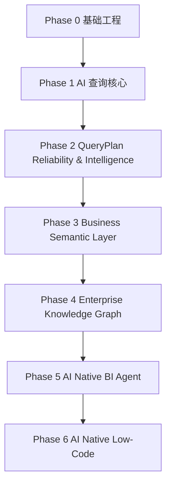
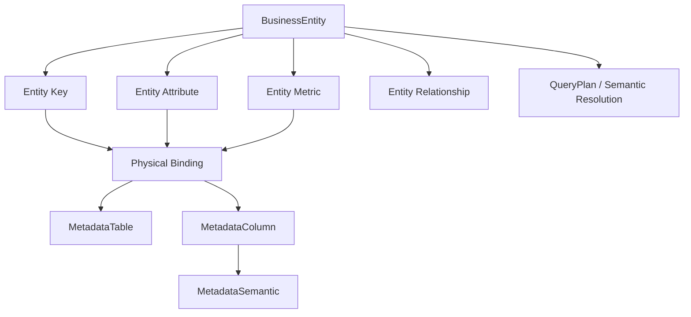

# SuperBuilder AI Native BI
# Phase开发计划（正式版）

版本：v3.0

文档状态：**Phase 3.1 开发基线**

当前开发阶段：**Phase 3.1 — Business Entity Model / Contract Design**

当前冻结基线：**Phase 2.7 — CLOSED / FROZEN**

当前源码基线：GitHub `master`

项目名称：SuperBuilder AI Native BI

更新日期：2026-08-27

---

# 1. 项目定位

SuperBuilder AI Native BI 面向企业数据智能分析，目标不是单纯生成 SQL，而是建立可靠的业务语义、查询规划、验证、决策和执行链路。

```text
用户自然语言问题
        ↓
AI / Query Understanding
        ↓
Business Semantic
        ↓
Metadata Semantic
        ↓
QueryPlan
        ↓
Validation / Repair
        ↓
Confidence / Decision Gate
        ↓
SQL Builder
        ↓
Database Execution
        ↓
Result Understanding
        ↓
Business Answer
```

Phase 3 的核心升级：

```text
理解字段
  ↓
理解业务实体
  ↓
理解实体属性、指标与关系
  ↓
稳定映射到 Metadata / QueryPlan
```

---

# 2. 总体技术路线



| 阶段 | 目标 | 状态 |
|---|---|---|
| Phase 0 | 基础工程架构 | ✅ 已完成 |
| Phase 1 | AI智能查询核心能力 | ✅ 已完成 |
| Phase 2 | QueryPlan可靠性与智能决策 | ✅ CLOSED / FROZEN |
| Phase 3 | 企业业务语义层 | 🚧 当前阶段 |
| Phase 4 | 企业知识图谱 | 📌 规划 |
| Phase 5 | AI Native BI Agent | 📌 规划 |
| Phase 6 | AI Native Low-Code融合 | 📌 规划 |

---

# 3. Phase开发总览

## Phase 2 Frozen Foundation

```text
Phase 2
│
├── 2.1 QueryPlan Foundation
├── 2.2 QueryPlan Semantic Validation
├── 2.2.5 QueryPlan Auto Repair
├── 2.3 QueryPlan Repair Reliability
├── 2.4 QueryPlan Confidence & Decision Gate
├── 2.5 QueryPlan Explainability
├── 2.6 Query Evaluation Framework
└── 2.7 Advanced SQL Planning
        ↓
     CLOSED / FROZEN
```

## Phase 3 当前路线

```text
Phase 3
│
└── 3.1 Business Entity Model
    │
    ├── 3.1.1 Current Source Audit              ✅ PASS
    ├── 3.1.2 Business Entity Contract            ✅ PASS
    ├── 3.1.3 Entity Key Contract                ⏳
    ├── 3.1.4 Entity Attribute Contract           ⏳
    ├── 3.1.5 Entity Metric Contract              ⏳
    ├── 3.1.6 Entity Relationship Contract        ⏳
    ├── 3.1.7 Physical Binding Contract           ⏳
    ├── 3.1.8 QueryPlan Mapping Contract          ⏳
    ├── 3.1.9 Golden Contract                     ⏳
    ├── 3.1.10 Runtime Verification Design        ⏳
    └── 3.1.11 Source Implementation Mapping      ⏳
```

每完成一个 STEP，必须记录实际结果并更新本开发计划；后续步骤不得提前标记完成。

---

# 4. 阶段事实与冻结原则

## 4.1 源码事实原则

所有完成度判断以 GitHub `master` 最新源码为第一事实来源。设计文档、历史讨论、README 和规划内容不能单独证明功能完成。

## 4.2 Frozen 原则

Phase 2.7 已形成稳定执行基础。Phase 3 不得为了引入 Business Entity 而重新定义 Phase 2.7 已冻结的 QueryPlan、Evaluator、Golden、Decision Gate 或 SQL Builder Contract。

## 4.3 推进原则

```text
源码审计
 ↓
Contract Design
 ↓
源码映射
 ↓
Golden Design
 ↓
Runtime Design
 ↓
实现
 ↓
Build
 ↓
Runtime 验证
 ↓
验收
 ↓
冻结
```

禁止：设计完成即宣布代码完成。

---

# 5. Phase 0 基础工程架构

状态：**✅ 已完成**

目标：建立 Controller / Application / Domain / Infrastructure / Database 分层、DI、数据库访问和基础配置能力。

---

# 6. Phase 1 AI智能查询核心能力

状态：**✅ 已完成**

核心能力：

```text
Natural Language
 ↓
Query Understanding
 ↓
Metadata Semantic Search
 ↓
QueryPlan
 ↓
SQL Builder
 ↓
Database
```

核心对象包括 QueryIntent、QueryMetric、QueryFilter、QueryDimension、QueryPlan。

---

# 7. Phase 2 QueryPlan可靠性与智能决策

状态：**✅ CLOSED / FROZEN**

Phase 2 将“能够生成查询”升级为“能够验证、修复、解释、评估并决定是否允许执行”。

```text
QueryPlan
 ↓
Context / Semantic Validation
 ↓
Repair
 ↓
Repair Trace
 ↓
Confidence
 ↓
Decision Gate
 ↓
Explainability
 ↓
Evaluation / Golden
 ↓
Advanced SQL Planning
```

Phase 2 的既有 Contract 在 Phase 3 中视为 Frozen Foundation。

---

# 8. Phase 2.7 Advanced SQL Planning

状态：**✅ CLOSED / FROZEN**

Frozen 边界包括 QueryPlan、Semantic Resolution、Dimension Resolution、Join Resolution、Evaluator、Golden Dataset、Decision Gate 和 SQL Builder 的既有执行契约。

Phase 3 只能在这些能力之上增加 Business Semantic Layer，不得通过隐式修改破坏已有执行链路。

---

# 9. Phase 2 总体验收

Phase 2 进入 Phase 3 的条件：

- D14–D20 Frozen
- D21 Exit Review Frozen
- Golden / Runtime 验证通过
- Build / Startup 验证通过
- Phase 2.7 CLOSED
- 不再有未关闭的 Phase 2 Gate

因此 Phase 3 从明确的 Frozen 基线开始。

---

# 10. Phase 3 企业业务语义层

## 10.1 阶段目标

从：

> 用户说的词对应哪个数据库字段？

升级到：

> 用户说的业务对象是什么？它有哪些属性、指标和业务关系？这些业务语义如何稳定映射到已有 Metadata 与 QueryPlan？

## 10.2 核心演进

```text
Metadata Semantic
      ↓
Business Entity Semantic
      ↓
Entity Resolution
      ↓
QueryPlan Mapping
      ↓
Existing Phase 2.7 Execution Foundation
```

## 10.3 Phase 3.1 非目标

- 重构 QueryPlan
- 重构 QueryIntent
- 修改 Evaluator Contract
- 修改 Phase 2.7 Golden Expected Outcome
- 修改 Decision Gate
- 直接从 Entity 生成 SQL
- 知识图谱
- 自动实体学习
- 复杂 Ontology

---

# 11. Phase 3.1 Business Entity Model

状态：**🚧 CURRENT — Contract Design**

## 11.1 目标

建立第一版稳定、可执行、可验证的 Business Entity Contract。

```text
BusinessEntity
├── BusinessEntityKey
├── BusinessEntityAttribute
├── BusinessEntityMetric
└── BusinessEntityRelationship
```

统一通过 Physical Binding 映射已有 Metadata。

## 11.2 总体模型



## 11.3 3.1.1 Current Source Audit

状态：**✅ PASS**

审计基线：GitHub `master` Phase 2.7 Frozen 源码。

| 能力 | master 当前状态 | Phase 3.1 动作 |
|---|---|---|
| MetadataTable | 已存在，描述物理表、业务域、Embedding、Columns | 🟢 复用 |
| MetadataColumn | 已存在，包含 BusinessKey、PK、Semantic | 🟢 复用 |
| MetadataSemantic | 已存在，承担字段级业务语义 | 🟢 复用 |
| QueryPlan | 已存在，承载 Metrics / Dimensions / Filters / Joins | ⛔ Frozen，不重构 |
| QueryJoin | 已存在，表示本次 QueryPlan 的动态 JOIN | ⛔ Frozen，不等同 Business Relationship |
| BusinessEntity | 当前无直接等价物 | 🔴 新增 |
| EntityKey | 当前无独立业务实体身份 Contract | 🔴 新增 |
| EntityAttribute | 当前无独立业务实体属性 Contract | 🔴 新增 |
| EntityMetric | 当前 QueryMetric / Metric Resolution 可提供基础 | 🟡 新增 Entity 语义层 |
| EntityRelationship | 当前 QueryJoin / Join Resolution 不等价 | 🔴 新增 |
| PhysicalBinding | 无独立 Contract；现有 Metadata Identity 可承载 | 🟡 新 Contract，优先复用 Metadata Identity |
| Entity Resolution | 当前无独立 Entity Resolution 层 | 🔴 新增 |
| Entity → QueryPlan Mapping | 当前主要由 QueryPlan Resolution 承担 | 🟡 增加 Mapping / Adapter，不破坏 Frozen Contract |

已审计源码：

```text
Models/Metadata/MetadataTable.cs
Models/Metadata/MetadataColumn.cs
Models/Metadata/MetadataSemantic.cs
Models/BI/QueryPlan.cs
Models/BI/QueryJoin.cs
```

3.1.1 冻结结论：

```text
Physical Metadata
        ↓
MetadataTable / MetadataColumn / MetadataSemantic
        ↓
Physical Binding
        ↑
Business Entity Layer
        ↓
Entity Resolution
        ↓
Frozen QueryPlan Foundation
```

**核心边界：Business Entity ≠ MetadataTable；Business Relationship ≠ QueryJoin；Business Entity 不直接生成 SQL；Phase 3.1 不修改 Phase 2.7 Frozen QueryPlan / Evaluator / Golden / Decision Gate / SQL Builder Contract。**

---

# 12. Phase 3.1 Contract

## 12.1 3.1.2 Business Entity Contract

状态：**✅ PASS — Contract 已确认**

### 12.1.1 Contract 定义

```text
BusinessEntity
├── Id
├── BusinessKey
├── Name
├── DisplayName
├── Description
├── BusinessDomain
├── SemanticText
└── Status
```

### 12.1.2 字段职责

| 字段 | 职责 | 规则 |
|---|---|---|
| Id | Entity 技术身份 | Entity 层唯一标识 |
| BusinessKey | 稳定业务身份 | 不绑定数据库表名 |
| Name | 内部语义名称 | 稳定、可用于 Resolution |
| DisplayName | 展示名称 | 面向业务用户 |
| Description | 业务对象说明 | 用于语义理解与解释 |
| BusinessDomain | 所属业务域 | 用于 Entity Resolution 范围约束 |
| SemanticText | Entity 语义文本 | 用于检索 / Resolution，不保存 SQL |
| Status | 生命周期状态 | 控制启用 / 停用 |

### 12.1.3 核心边界

```text
BusinessEntity
      │
      ├── 描述业务对象
      ├── 提供稳定业务身份
      ├── 承载实体级语义
      └── 参与 Entity Resolution

BusinessEntity
      X
      └── 不直接保存 / 生成 SQL
```

### 12.1.4 Entity 与物理表边界

正式确认：

```text
BusinessEntity ≠ MetadataTable
```

一个 BusinessEntity 可以通过多个 PhysicalBinding 映射多个 MetadataTable / MetadataColumn；因此不能把 TableName 当作 BusinessKey，也不能让 Entity Contract 直接依赖某一个物理表。

### 12.1.5 Entity Resolution 边界

```text
User Question
      ↓
Entity Resolution
      ↓
BusinessEntity
      ↓
Entity Key / Attribute / Metric / Relationship
      ↓
Physical Binding
      ↓
QueryPlan Mapping
```

BusinessEntity 只负责业务语义身份，不绕过现有 QueryPlan 直接进入 SQL Builder。

### 12.1.6 与 Phase 2.7 Frozen Contract 的关系

3.1.2 不修改：

- QueryPlan
- QueryPlanSemanticResolution
- QueryPlan Evaluator
- Golden Expected Outcome
- Decision Gate
- SQL Builder

BusinessEntity 是 Phase 2.7 之上的新增语义层。

### 12.1.7 3.1.2 最终结论

**3.1.2 PASS。BusinessEntity Contract 可以作为后续 EntityKey / Attribute / Metric / Relationship Contract 的父级语义边界。**

注意：PASS 仅表示 Contract Design 完成，不表示代码已经实现。

---

## 12.2 3.1.3 Entity Key Contract

状态：**⏳ NEXT**

```text
BusinessEntityKey
├── BusinessEntityId
├── Name
├── IsPrimary
└── PhysicalBinding
```

---

## 12.3 3.1.4 Entity Attribute Contract

状态：**⏳**

```text
BusinessEntityAttribute
├── BusinessEntityId
├── Name
├── DisplayName
├── Description
└── PhysicalBinding
```

---

## 12.4 3.1.5 Entity Metric Contract

状态：**⏳**

```text
BusinessEntityMetric
├── BusinessEntityId
├── Name
├── DisplayName
├── Description
├── Aggregation
└── PhysicalBinding / Metric Resolution
```

---

## 12.5 3.1.6 Entity Relationship Contract

状态：**⏳**

```text
BusinessEntityRelationship
├── SourceEntityId
├── TargetEntityId
├── RelationshipType
├── Cardinality
└── Physical Join Binding
```

---

## 12.6 3.1.7 PhysicalBinding Contract

状态：**⏳**

```text
PhysicalBinding
├── DataSourceId
├── MetadataTableId
├── MetadataColumnId
└── BusinessKey
```

原则：Business Entity 不重新定义 Physical Identity；复用现有 Metadata Identity。

---

# 13. Phase 3.1 源码映射

状态：**⏳ 未完成**

3.1.1 已完成基础源码审计；完整 Mapping 仍需继续核查 QueryPlan Semantic Resolution、Metric / Dimension Resolution、Join Inference、Evaluator、Golden、DI 与 Controller / Service 调用链。

目标映射：

| Contract | 当前源码基础 | Phase 3.1 动作 |
|---|---|---|
| BusinessEntity | 当前无直接等价物 | 新增 |
| EntityKey | MetadataColumn / Primary Key | 建立业务身份层 |
| EntityAttribute | MetadataColumn + MetadataSemantic | 建立业务属性层 |
| EntityMetric | QueryMetric / Metric Resolution | 建立实体指标层 |
| EntityRelationship | QueryJoin / Join Resolution | 建立业务关系层 |
| PhysicalBinding | MetadataColumn / BusinessKey | 优先复用 |
| Entity Resolution | 当前无独立 Entity 层 | 新增 |
| QueryPlan Mapping | QueryPlan Resolution | Adapter / Mapping，不破坏 Frozen Contract |

---

# 14. Phase 3.1 Golden 与 Runtime 验证

状态：**⏳ 待完成**

## Golden 路线

```text
Entity Resolution Golden
        ↓
Entity → Metadata Binding Golden
        ↓
Entity → QueryPlan Golden
        ↓
Phase 2.7 Frozen Evaluator / Golden 回归
```

Phase 3 Golden 只能新增覆盖，不修改 Phase 2.7 Frozen Golden 的既有语义。

## Runtime 路线

```text
Contract Unit Verification
        ↓
Entity Resolution
        ↓
Physical Binding
        ↓
Entity → QueryPlan Mapping
        ↓
Existing Phase 2.7 Validation
        ↓
Existing Evaluator
        ↓
Existing SQL / Runtime Path
```

---

# 15. Phase 3.1 验收标准

只有同时满足 Contract、Source、Golden、Runtime、Engineering 五类条件才能关闭：

### Contract

- BusinessEntity Contract 冻结
- Key / Attribute / Metric / Relationship Contract 冻结
- PhysicalBinding Contract 冻结
- QueryPlan Mapping Contract 冻结

### Source

- 完成相关源码逐文件审计
- 明确新增 / 复用 / 扩展 / 禁止修改范围
- DI、调用链和 namespace 边界明确

### Golden

- Entity Resolution Golden 建立
- Entity → QueryPlan Golden 建立
- 不破坏 Phase 2.7 Frozen Golden

### Runtime

- Entity Resolution Runtime 验证通过
- Physical Binding Runtime 验证通过
- Entity → QueryPlan Runtime 验证通过
- Existing Phase 2.7 Runtime 回归通过

### Engineering

- Build PASS
- Startup PASS
- 无明显 Contract 漂移
- 文档 / 源码 / Golden / Runtime 四方一致

最终状态：

```text
Phase 3.1
    CLOSED / FROZEN
```

---

# 16. Phase 4 企业知识图谱

状态：📌 规划

在稳定 Business Entity Model 基础上建立企业实体、关系、事件与知识网络，不提前侵入 Phase 3.1。

---

# 17. Phase 5 AI Native BI Agent

状态：📌 规划

在可靠 Query Planning 与 Business Semantic 基础上形成可执行的 BI Agent。

---

# 18. Phase 6 AI Native Low-Code融合

状态：📌 规划

将 AI Query、Business Semantic、Agent 与低代码应用能力融合。

---

# 19. 总体开发优先级

```text
P0  Phase 2.7 Frozen Foundation
        ↓
P1  Phase 3.1 Contract Design
        ↓
P2  Phase 3.1 Source Audit / Mapping
        ↓
P3  Phase 3.1 Golden / Runtime Design
        ↓
P4  Phase 3.1 Implementation
        ↓
P5  Phase 3.1 Verification / Freeze
        ↓
P6  Phase 3.2+ Business Semantic Capabilities
        ↓
P7  Phase 4 Knowledge Graph
        ↓
P8  Phase 5 Agent
        ↓
P9  Phase 6 Low-Code
```

---

# 20. 阶段冻结与变更控制

## 20.1 Frozen Contract 不得隐式修改

Phase 2.7 Frozen 后，涉及以下对象的修改必须显式记录：

- QueryPlan
- QueryPlanSemanticResolution
- QueryPlan Evaluator
- Golden Expected Outcome
- Decision Gate
- SQL Builder
- Existing Runtime Contract

## 20.2 Phase 3 新增能力必须有边界

```text
Business Semantic Layer
        ↓
Entity Resolution / Mapping
        ↓
Frozen QueryPlan Foundation
```

禁止：

```text
Business Entity
        ↓
绕过 QueryPlan
        ↓
直接 SQL
```

## 20.3 文档同步原则

每次 Phase / STEP 状态发生变化，必须同步更新：

```text
Phase开发计划
    +
总体设计方案
    +
架构白皮书
    +
STEP / Runtime 状态文档
    +
源码 / Golden
```

阶段切换或 STEP 完成的第一动作必须是更新开发计划，随后才能开始下一步骤。

---

# 21. 当前阶段结论

```text
Phase 2.7
    CLOSED / FROZEN

        ↓

Phase 3
    CURRENT

        ↓

Phase 3.1
    Business Entity Model
    Contract Design
        │
        ├── 3.1.1 Current Source Audit  ✅ PASS
        ├── 3.1.2 Business Entity Contract ✅ PASS
        └── 3.1.3+                     ⏳
```

当前下一动作：

> **3.1.3 Entity Key Contract**

推进规则：每完成一个 3.1.x STEP，必须给出最终结论、立即更新本开发计划、重新从 `master` 回读验证，然后才能进入下一个 STEP。
